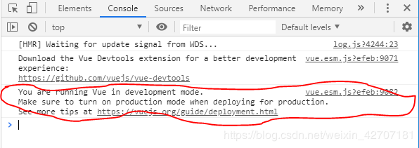
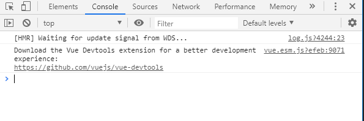

# Vue全家桶

# Vue2.5
## 0. 准备
1.安装vue-cli

```basic
1. npm install -g @vue/cli  
npm i -g @vue/cli version 3.x
2. npm install -g @vue/cli-service-global
```
2.新建项目

```basic
vue create vue-buy
```
3.选择配置

```basic
1. Babel代码转义
2. Linter代码风格
3. 测试
```
4.启服务

```basic
npm run serve
```
5.项目结构

6.一些概念解析

**框架和库**

```basic
库，是一封装好的特定方法的集合，提供给开发者使用，库没有控制权，控制权在使用者手中，代表：jq、underscore、util
    
框架，框架顾名思义就是一套架构，会基于自身的特点向用户提供一套相当完整的解决方案，而且控制权的在框架本身，使用者要找框架所规定的某种规范进行开发，代表：backbone、angular、vue
```

**理解渐进式**

```basic
所谓渐进式，可以一步一步，有阶段性的使用vue，不是必在一开始把所有的东西都用上。
1.声明式的渲染（Declarative Rendering）
2.组件系统（component System）
3.客户端路由器（vue-router）
4.大规模的状态管理（vuex）
5.构建工具（vue-cli）
```

**vue的两个核心点**

```basic
1.响应式的数据绑定
    当数据发生变化->视图自动更新
    忘记操作DOM这回事，而是专注于操作数据
2.可组合的视图组件
    把视图按照功能，切分若干基本单元
    组件可以一级一级组合成整个应用，形成了倒置的组件树
    使用组件的好处：可维护、可重用、可测试
```

**MVVM模式**

```basic
M:Model数据
V:view视图
VM:view-model视图模型
```

**声明式渲染**

```basic
声明式：只需要声明在哪里where 做什么what，而无需关心如何实现how
命令式：需要以具体代码表达在哪里where做什么what，如何实现how
声明式渲染理解：
    1.DOM状态只是数据状态的一个映射
    2.所有逻辑尽可能在状态的层面去进行
    3.当状态改变了，view会被框架自动更新到合理的状态
    
var arr = [1,2,3,4];
// 把数组中每一个属性X2，存在数组中

// 命令式
var newArr = [];
for( var i = 0; i < arr.length; i++ ){
	newArr.push(arr[i]*2)
}
console.log(newArr);

// 声明式
let newArr2 = arr.map(item => item * 2);
console.log(newArr2);
```

**响应式原理——只有计划好的才能做响应**

```basic
把一个普通的JavaScript对象传给Vue实例的data选项
    
Vue将遍历此对象所有的属性，并使用Object.defineProperty把这些属性全部转为getter/setter
    
vue内部会对数据进行劫持操作，进而追踪依赖，在属性被访问和修改时通知变化
    
data对象中的数据都会转换为getter/setter，所以当数据发生变化时，自动更新在页面
    
如果没有定义某个属性，那么就不能检测属性的变化（只有计划好的才能做响应）
```

**对象响应式**

```basic
data(){
    miaov:{
        abc:123
    }
}

1.Vue.set（target,key,value）——静态方法
设置对象的属性。如果对象是响应式的，确保属性被创建后也是响应式的，同时触发视图更新。这个方法主要用于避开Vue不能检测属性被添加的限制

静态方法是挂载在函数上的方法，调用的时候通过函数调用

2.vm.$set(target,key,value)——实例上的方法$set
实例上的方法，
原型上的方法，需要通过实例调用

3.改写属性的值，重新赋值
vm.miaov={ketang:'新的'}

3.替换对象
//Object.assign返回的是第一个参数
vm.miaov=Object.assign(vm.miaov,{ketang:'新的'})————相当于
vm.miaov.ketang='新的'//这样并不会更新视图

//重新赋值是可以的——给一个空对象重新赋值
vm.miaov=Object.assign({}，vm.miaov,{ketang:'新的'})

注意：对象不能是Vue实例，或者Vue实例的根数据对象
```

**数组响应式**

```basic
data(){
    list:[1,2,3]
}
1.数组的变异方法：提供了观察数组的变异方法，使用这些方法将会触发视图更新，push()、pop()、shift()、unshift()、splice()、sort()、reverse()——会改变原数组

map()、filter()不会改变原数组
//如果非要改变原数组，那么直接给原数组重新赋值
vm.list=vm.list.map(item=>item*3)

2.不能触发视图更新：利用索引直接设置一个项时，修改数组的长度时
vm.list[0]='miaov'//监控不到变化

vm.list.splice(0,1,'miaov')//这种方式可以——删除第一项，并替换成'miaov'

vm.list.length=1//这种方式不可以改变数组长度的
```
**事件传参**

```basic
当给事件的方法传参后，需要手动使用$event把时间对象传给方法
@click='test($event,123)'  
```

**删除对象的属性**
    
```basic
this.$delete(this.choose,key)——实例上的方法
```

**计算属性**

```basic
计算属性computed中，它不是方法，属性的值是函数的返回值

把对处理数据的逻辑抽离在计算属性中，使得模板更加轻量易读

计算属性的值会被缓存，根据依赖的数据变化而重新计算

计算属性的使用：
   取值：触发get函数，默认设置的函数
   赋值：触发set函数
定义计算属性：
    //计算属性挂在实例上
    //计算属性对应的函数this都指向实例
    //计算属性会把结果缓存，可在模板中重复使用
    //计算属性中依赖了data中的数据，data中的数据发生变化，计算属性会重新计算
    //定义了计算属性，没有使用，那不会执行这个函数
   computed:{
       
   }
对计算属性操作：
    只给计算属性一个函数，默认这个函数是在取值的时候触发的
    取值：触发get(){}函数
    设置值：触发set(newValue){}函数
    如果要对计算属性设置：取值与设置值，那这个计算属性不应该是函数了，应该是一个对象
```
**Object.defineProperty：数据劫持（vue核心）**
    
```basic
-作用
    直接在一个对象上定义一个新属性，或者修改一个对象的现有属性
    
-语法
    Object.defineProperty(obj，prop，descriptor)
    
-参数
    obj要在其上定义属性的对象
    prop要定义或修改的属性名称
    descriptor将被定义或修改的属性描述符
    数据描述：（新添加的都默认为false）
        configurable:是否可以删除目标属性，默认为false
        enumerable:此属性是否可以被枚举，默认为false
        value:改属性对应的值，默认为undefined
        writable:属性的值是否可以被重写，默认为false
    访问器描述：
        getter：是一种忽的属性值的方法
        setter：是一种设置属性值的方法
        可以写configurable、enumerable
        不能写value、writable
    删除对象属性：
        delete data.title
    把属性转成访问器的方式：
        getter：获取属性触发的
        setter：设置属性触发的
```


​    
## 1. VueJs基础语法
**v-text**
```basic
更新元素的textContent，可代替{{}}，直接用{{}}的话，网络慢的话，刚开始会出现{{}}，对用户不友好，所以可以使用v-text
```
**v-html**
```basic
更新元素的innerHTML，识别标签<div>hello</div>
不使用则指令，插入的html结果不作为模板编译，作为文本显示
不要插入不安全的html结构，有可能受到xss攻击
```
**v-cloak**

```basic
隐藏未编译的Mustache（小胡子语法）标签直到实例准备完毕
    <style>
    	[v-cloak]{
    		display: none;//渲染完毕之后才会出现
    	}
    </style>
    <div id="app" v-cloak>
    	<p>{{message}}</p>
    </div>
```
**v-once**
```basic
只渲染一次，随后数据改变将不再重新渲染，视为静态内容，用于优化更新性能
    <div id="app" v-cloak>
		<p v-once>{{message}}</p>
	</div>
```
**v-if**
**v-for**
```basic
循环对象：v-for="value,key,index in obj"
index是根据object.keys()——拿到每个对象的key值，放在数组中的顺序

v-for和v-if不应该一起使用，必要情况下应该替换成computed属性。

原因：v-for比v-if优先，如果每一次都需要遍历整个数组，将会影响速度，尤其是当之需要渲染很小一部分的时候。

<ul>
    <li
      v-for="user in users"
      v-if="user.isActive"
      :key="user.id"
    >
      {{ user.name }}
    </li>
</ul>
如上情况，即使100个user中之需要使用一个数据，也会循环整个数组。

正确写法：
computed: {
    activeUsers: function () {
        return this.users.filter(function (user) {
          return user.isActive
        })
    }
}
<ul>
    <li
      v-for="user in activeUsers"
      :key="user.id"
    >
    {{ user.name }}
    </li>
</ul>
```
**v-on**
```basic
-简写为@
事件处理函数写在methods中
在模板中不传参，只写上函数名字，函数第一个参数是时间处理函数（$event）
在模板中传参，需要手动在模板中使用$event传入事件对象
事件处理函数中this都指向实例

-事件修饰符：
方法只有纯粹的数据逻辑，而不是去处理DOM事件细节。
语法：v-on:事件名.修饰符='事件处理函数'
.stop（阻止冒泡） .prevent（阻止默认事件） .capture（捕获） .self .once

<a @click.prevent="prevent" href="http://www.miaov.com">miaov</a>
<a @click.prevent href="http://www.miaov.com">miaov</a>//只阻止默认事件，不给新的事件

-先捕获后冒泡：
<div @click.capture="demo1">//捕获
	demo1
	<div @click.self="demo2">//self只有点自己才会触发（判断事件源来决定触发不触发）
		demo2
		<!-- <div @click.stop.once="demo3">demo3</div> -->//once只执行一次，
		<div @click.stop="demo3">demo3</div>
	</div>
</div>
-按键修饰符：
.enter .tab .delete .esc .space .up .down .left .right
<input type="text" @keyup.enter="uphandle" />
<input type="text" @keyup.13="uphandle" />
<input type="text" @keyup.65="uphandle" />

```
**v-modal**
```basic
数据双向绑定
```
## 2. Vue-cli3脚手架
命令行工具 npm i -g @vue/cli version 3.x

创建 vue create vue-test

运行 vue run serve

打包 vue runbuild

vue添加插件：element

vue add element
## 3. 使用.vue单文件开发组件
...good：属性展开


computed与watch的区别
computed：

传参总线模式
```basic
Vue.prototype.$bus=new Vue();
this.$bus.$emit(名称，数据);
this.$bus.$on(名称，函数)
//也可以用根元素去获取根的vue
this.$root.$emit(名称，数据)
this.$root.$on(数据，函数)
```

## 4. ES6模块化机制

- **find() findIndex()**

数组实例的 find() 和 findIndex()
数组实例的find方法，用于找出第一个符合条件的数组成员。它的参数是一个回调函数，所有数组成员依次执行该回调函数，直到找出第一个返回值为true的成员，然后返回该成员。如果没有符合条件的成员，则返回undefined。
```basic
[1, 4, -5, 10].find((n) => n < 0)
// -5
```
上面代码找出数组中第一个小于 0 的成员。
```basic
[1, 5, 10, 15].find(function(value, index, arr) {
  return value > 9;
}) // 10
```
上面代码中，find方法的回调函数可以接受三个参数，依次为当前的值、当前的位置和原数组。

数组实例的findIndex方法的用法与find方法非常类似，返回第一个符合条件的数组成员的位置，如果所有成员都不符合条件，则返回-1。
```basic
[1, 5, 10, 15].findIndex(function(value, index, arr) {
  return value > 9;
}) // 2
```

- **filter()**

this.cart.filter(c => c.active),返回符合条件的

## 5. 实现一个购物车项目
- **App.vue**
```basic
<template>
    <ul>
      <li v-for="(good,index) in goods" :key="good.id">
        <span>{{good.text}}</span>
        <span>￥{{good.price}}</span>
        <el-button @click="addGood(index)">添加购物车</el-button>
      </li>
    </ul>
</template>
<script>
import Cart from './components/Cart.vue'
export default {
  name: 'app',
  data(){
    return {
      name:'vue购物车',
      goods:[]
    }
  },
  components: {
    Cart
  },
  async created(){
    try{
      const res=await this.$axios.get('/api/goods');
      console.log(res);
      this.goods=res.data.data;
    }catch(error){
      //错误处理
    }
  },
  methods:{
    addGood(i){
      const good=this.goods[i];
      this.$bus.$emit('addCart',good);
    }
  }
}
</script>

```
- **cart组件**

```basic
<template>
    <div id="cart">
        <h1>{{name}}</h1>
        <!--购物车列表-->
        <table border="1">
            <tr>
                <th>#</th>
                <th>课程名</th>
                <th>单价</th>
                <th>数量</th>
                <th>价格</th>
            </tr>
            <tr v-for="(c,index) in cart" :key="c.id" :class="{active:c.active}">
                <td>
                    <input type="checkbox" v-model="c.active">
                </td>
                <td>{{c.text}}</td>
                <td>{{c.price}}</td>
                <td>
                    <button @click="minus(index)">-</button>
                    {{c.count}}
                    <button @click="add(index)">+</button>
                </td>
                <td>￥{{c.price*c.count}}</td>
            </tr>
            <tr>
                <td></td>
                <td colspan="2">{{activeCount}}/{{count}}</td>
                <td colspan="2">￥{{total}}</td>
            </tr>
        </table>
    </div>
</template>

<script type="text/ecmascript-6">
    export default {
        name: "Cart",
        props: ['name'],
        data() {
            return {
                cart: JSON.parse(localStorage.getItem("cart")) || []
            }
        },
        created() {
            console.log(this.cart);
            //监听父组件添加商品事件
            this.$bus.$on('addCart', good => {
                //find方法：找到对应的项并返回
                const ret = this.cart.find(c => c.id == good.id);
                if (ret) {
                    ret.count += 1
                } else {
                    this.cart.push({
                        ...good,//将对象中的属性展开
                        count: 1,
                        active: true
                    })
                }
            })

        },
        methods: {
            minus(index) {
                const count = this.cart[index].count;
                if (count > 1) {
                    this.cart[index].count -= 1
                } else {
                    this.remove(index);
                }

            },
            add(index) {
                this.cart[index].count += 1
            },
            remove(index) {
                if (window.confirm('确定删除吗？')) {
                    this.cart.splice(index, 1)
                }
            }
        },
        computed: {
            activeCount() {
                //filter:留下符合条件的
                return this.cart.filter(c => c.active).length
            },
            count() {
                return this.cart.length
            },
            total() {
                let num = 0;
                this.cart.forEach(c => {
                    if (c.active) {
                        num += c.price * c.count
                    }
                })
                return num;
            }
        },
        watch: {
            cart: {
                handler(newVal,oldVal) {
                    console.log(oldVal);
                    localStorage.setItem("cart",JSON.stringify(newVal))
                },
                deep: true
            }
        }
    }
</script>

<style scoped>
    .active {
        color: red;
    }
    table {
        margin: 0 auto;
    }
</style>
```
- **购物车思考-数据持久化：localStorage**

用到watch：

```basic
data() {
    return {
        cart: JSON.parse(localStorage.getItem("cart")) || []
    }
},
watch: {
    cart: {
        handler(newVal,oldVal) {
           localStorage.setItem("cart",JSON.stringify(newVal))
        },
        deep: true
    }
}
```
**注意：**
localStorage.setItem() 不会自动将Json对象转成字符串形式

~~~basic
1. 存储前先用JSON.stringify()方法将json对象转换成字符串形式
2. JSON.stringify() 方法可以将任意的 JavaScript 值序列化成 JSON 字符串
```
var obj = {"a": 1,"b": 2};
obj = JSON.stringify(obj); //转化为JSON字符串
localStorage.setItem("temp2", obj);//返回{"a":1,"b":2}
```
3. 后续要操作该JSON对象，要将之前存储的JSON字符串先转成JSON对象再进行操作
```
obj=JSON.parse(localStorage.getItem("temp2"));
```
~~~

## 6. 深入了解Vue的组件化机制
#### 1)学习vuejs组件化
#### 2)组件的分类
- 1. 通用组件

    基础组件，大部分UI库都是这种组件，比如表单、布局、弹窗等
- 2. 业务组件

    和需求挂钩，会被复用，比如抽奖，摇一摇等等
- 3. 页面组件

    每个页面都是一个组件，不会复用
  
    ##### 第三方组件的使用
    - 最流行的element的使用，**npm i element-ui**安装
    - 在vue-cli中可以使用**vue add element**安装
    - 安装后，会有一个选项：完整导入（**Fully import**）还是只导入要求的（**Import on demand**）
    - 安装的时候要提前将代码提交到git上，因为装element的是时候，会将代码覆盖掉

#### 3)组件化设计思想
**1. 组件注册**
- 全局注册
    ```basic
    Vue.component('名称',{
        data(){
            return {
                
            }
        },
        template:''
    })
    ```
- 局部注册（推荐，依赖可追溯）
    ```basic
    new Vue({
        el:'#app',
        components:{
            名称
        }
    })
    ```
**2. 组件使用**

**3. props传值**
- 父子组件传值

```basic
props
props:{
    title:{
        type:String,
        required:true//必须传参
    }
}
```

**4. 组件事件**
- 子组件给父组件传参
```basic
//子组件
this.$emit(事件名称，{msg:'hello'})
//父组件
this.$on(事件名称，function(data) {
    
})

```
**5. 实现组件的双向绑定**

**v-model仅仅是一个语法糖**
```basic
<input v-model="something"></input>

//相当于
<input v-bind:value="something" v-on:input="something=$event"></input>
```

```basic
//input组件：要绑定value，要响应input事件
<template>
    <!--实现数据双向绑定-->
    <div id="inputName">
        <input type="text" :value="inputValue" @input="inputHandler">
    </div>
</template>

<script>
    export default {
        name: "Input",
        props:{
            value:{
                type:String,
                default:''//默认值
            },
            type:{
                type:String,
                default: 'text'
            }
        },
        data() {
            return {//单向数据流原则：组件内不能修改props属性
                inputValue: this.value
            }
        },
        methods: {
            inputHandler(e) {
                this.inputValue=e.target.value;
                //通知父组件值更新
                //因为是语法糖，所以通知父组件的事件名input并不能自主去修改
                this.$emit('input',this.inputValue)
            }
        },
    }
</script>

<style scoped>
    #inputName {
        margin-top: 20px;
    }
</style>

//父组件
<k-input v-model="someValue"></k-input>{{someValue}}
```
**6. 扩展组件-插槽**
- 插槽用来扩展组件的内容
- 容器性的组件
- 匿名插槽/具名插槽
```basic
//组件内
<template>
    <div id="slot">
        <h1>插槽</h1>
        <div class="head">
            <!--具名插槽-->
            <slot name="head"></slot>
        </div>
        <!--匿名插槽-->
        <slot></slot>
        <div class="foot">
            <!--具名插槽-->
            <slot name="foot"></slot>
        </div>
    </div>
</template>

//组件调用
<k-slot>
  <template slot="head">
    <h1>head</h1>
  </template>
  <h4>content....</h4>
  <template slot="foot">
    <h5>foot</h5>
  </template>
</k-slot>
```
#### 4)深入了解vue的组件化机制
**1.Form组件设计**
- KForm负责定义校验规则
- KFormItem负责显示错误数据
- KInput负责数据双向绑定
- 使用Provide&inject内部共享数据

**2.provide & inject**

业务中不常用到的api，主要用于高阶组件和组件库的使用，用来和所有子孙元素提供数据，类似react中，假设A.vue和B.vue，B是A的子组件
```basic
//A.vue
export default{
    provide:{
        name:'kaikeba'
    }
}

//B.vue
export default{
    inject:['name'],
    mounted(){
        console.log(this.name)
    }
}
```
<font color="red">provide是单向数据流，尽量不要在inject接收方对数据进行修改，如果是一个普通字符串，尝试改会报错，如果是响应式的值，会随响应改变。</font>

provide与inject绑定并不是响应式的，这是刻意为之的，然而，如果你传入了一个可监听的对象，那属性还是可响应的。

**3.Form组件的实现——第三方组件库element-ui的实现**
- 设计好组件后，最终的使用
```basic
<template>
    <div id="formName">
        <!--element组件-->
        <h1>element-form</h1>
        <el-form ref="form" :model="form" :rules="rules" label-width="80px">
            <el-form-item label="用户名" prop="name">
                <el-input v-model="form.name"></el-input>
            </el-form-item>
            <el-form-item label="密码" prop="pwd">
                <el-input v-model="form.pwd" type="password"></el-input>
            </el-form-item>
            <el-form-item>
                <el-button type="primary" @click="submit">提交</el-button>
            </el-form-item>
        </el-form>

        <!--开课吧表单组件-->

        <!--
        form的作用：绑定数据类型、添加校验规则
        formitem：label、prop-校验和显示错误
        input: input数据发生改变后，要通知formitem去做校验
        -->

        <!--完整的form组件-->
        <h1>k-form完整组件</h1>
        <k-form :model="form" :rules="rules" ref="form2">
            <k-form-item label="用户名" prop="name">
                <k-input v-model="form.name"></k-input>
            </k-form-item>
            <k-form-item label="密码" prop="pwd">
                <k-input v-model="form.pwd" type="password"></k-input>
            </k-form-item>
            <k-form-item>
                <el-button type="primary" @click="submit2">提交</el-button>
            </k-form-item>
        </k-form>

        {{form}}
    </div>
</template>

<script>
    import KInput from './Input.vue';
    import KFormItem from './FormItem.vue';
    import KForm from './Form.vue';
    export default {
        name: "Form",
        components:{KInput,KFormItem,KForm},
        data() {
            return {
                form: {
                    name: '',
                    pwd: ''
                },
                rules: {
                    name: [
                        {required:true,message:'请输入姓名'},
                        {min:3,max:6,message:'长度在是-6位字符'}
                    ],
                    pwd:[
                        {required:true,message:'请输入密码'}
                    ]
                }
            }
        },
        methods: {
            submit() {
                this.$refs.form.validate(valide=>{
                    if(valide) {
                       alert('提交登录！')
                    }else {
                        console.log('校验失败！')
                        return false;//阻止浏览器的默认提交，页面不会刷新
                    }
                })
            },
            submit2(){
                this.$refs.form2.validate(valide=>{
                    if(valide) {
                        alert('提交登录！')
                    }else {
                        console.log('校验失败！')
                        return false;//阻止浏览器的默认提交，页面不会刷新
                    }
                })
            }
        },
    }
</script>

<style scoped>

</style>
```
- form文件
```basic
<template>
    <form action="">
        <slot></slot>
    </form>
</template>

<script>
    export default {
        name: "Form",
        provide(){//将表单的实例传递给后代
            return {
                form:this//后代通过this，无论何时都可以拿到父组件的model、rules
            }
        },
        props:{
            model:{
                type:Object,
                required:true
            },
            rules:{
                type: Object
            }
        },
        data() {
            return {
                fields:[]
            }
        },
        created(){
            //缓存所有需要校验的项
            this.$on('formItemAdd',item=>this.fields.push(item))
        },
        methods: {
            async validate(callback) {
                //得到一个promise组成的数组（将formitem数组转换为validate()返回的promise数组）
                //此处的ite是子组件传来的this
                const tasks=this.fields.map(item=>item.validate())
                //获取所有结果统一处理(所有的结果处理完了，再去处理)
                let ret=true;
                const results=await Promise.all(tasks);
                results.forEach(valid=>{
                    if(!valid) {
                        //只要有一个时报
                        ret=false;
                    }
                })
                callback(ret);//回调将结果告诉
            }
        },
    }
</script>

<style scoped>

</style>
```
- formitem组件
```basic
<template>
    <div>
        <!--接收label值-->
        <label v-if="label">{{label}}：</label>
        <!--准备槽位-->
        <div style="display: inline-block">
            <slot></slot>
            <!--放错误信息-->
            <p v-if="validateStatus" class="error">{{errorMessage}}</p>
        </div>
    </div>
</template>

<script>
    import schema from 'async-validator';
    export default {
        inject:['form'],//注入form，获取model+rules
        name: "FormItem",
        props:['prop','label'],
        data() {
            return {
                validateStatus:'',
                errorMessage: ''
            }
        },
        created(){
            this.$on('validate',this.validate)
        },
        mounted(){
            //挂载到form上时，派发一个添加事件
            if(this.prop) {//prop存在的时候才去校验，不存在则不校验
                this.$parent.$emit('formItemAdd',this)
            }

        },
        methods: {
            //校验库：async-validator
            validate(value) {
                //此处的value是子组件传过来的
                //返回一个promise对象
                return new Promise(resolve => {
                    //校验当前项  依赖async-validator
                    //[this.prop]：ES6计算属性的写法
                    const descriptor={
                        [this.prop]:this.form.rules[this.prop]
                    };//校验规则

                    //创建schema实例
                    const validator=new schema(descriptor);
                    validator.validate({[this.prop]:this.form.model[this.prop]},errors=>{
                        if(errors) {
                            //校验失败
                            this.validateStatus='error';
                            this.errorMessage=errors[0].message;

                            resolve(false);//校验失败
                        }else {
                            this.validateStatus='';
                            this.errorMessage='';

                            resolve(true);//校验成功
                        }
                    })
                });
            }
        },
    }
</script>

<style scoped>
    .error {
        color: red;
    }
</style>
```
- input组件(规则校验用的是async-validator（element也是用的这个）)
```basic
<template>
    <!--实现数据双向绑定-->
    <div id="inputName">
        <input :type="type" :value="inputValue" @input="inputHandler">
    </div>
</template>

<script>
    export default {
        name: "Input",
        props:{
            value:{
                type:String,
                default:''//默认值
            },
            type:{
                type:String,
                default: 'text'
            }
        },
        data() {
            return {//单向数据流原则：组件内不能修改props属性
                inputValue: this.value
            }
        },
        methods: {
            inputHandler(e) {
                this.inputValue=e.target.value;
                //自己派发自己监听
                //通知父组件值更新
                //此处通知的名称-input是不能做更改的，
                this.$emit('input',this.inputValue);
                //通知formitem做校验
                //让formitem自己去派发事件，则可以接收到数据的变化
                //为什么不让input自己去派发事件呢？因为在formitem中还是slot槽，根本没办法去接收数据
                this.$parent.$emit('validate',this.inputValue)//将当前的值传出去
                //这边之所以使用$parent来派发，是因为做校验的是form-item，而$parent就是form-item，所以相当于是form-item自己派发自己监听

            }
        },
    }
</script>

<style scoped>
    #inputName {
        margin-top: 20px;
    }
</style>
```
#### 4)思考
**1.不同事件触发方式，怎么做校验**

- change
- input
- blur
- ...

派发事件的时候，事件类型要告诉一下

input标签的各种事件

```basic
最近在写一个手机端提交表单的项目，里面用了不少input标签，因为项目不太忙，所以，想做的完美点，但是遇到了一些问题，比如：页面中的必填项如果有至少一项为空，提交按钮就是不能提交的状态，所以需要对所有的input内容进行监听，刚开始我用了jquery的keyup事件解决问题，但是后来测试出一个bug，如果用户选择粘贴复制的话，keyup事件不能触发，也就不能通过判断input内容来改变提交按钮的状态。下面就这种问题做下总结，希望对自己和他人以后能有点帮助。
1.onfocus 当input 获取到焦点时触发
2.onblur 当input失去焦点时触发，注意：这个事件触发的前提是已经获取了焦点再失去焦点的时候会触发相应的js
3.onchange 当input失去焦点并且它的value值发生变化时触发
4.onkeydown 在 input中有键按住的时候执行一些代码
5.onkeyup 在input中有键抬起的时候触发的事件，在此事件触发之前一定触发了onkeydown事件
6.onclick 主要是用于 input type=button，当被点击时触发此事件
7.onselect 当input里的内容文本被选中后执行一段，只要选择了就会触发，不是非得全部选中
8.oninput 当input的value值发生变化时就会触发，不用等到失去焦点（与onchange的区别）
以上事件可以直接放到input的属性里，例如：<input type="text" onfocus="a();" onblur="b()" onchange="c();" onkeydown="d();" />，也可以通过js给input dom元素添加相应的事件，如：document.getElementByTagName('input').onfocus = function();
```
```basic
//input组件中
<input :type="type" :value="value" @input="onInput" @blur="onBlur" @change="onChange">
methods: {
    //不同事件的触发方式：如：input、blur等
    onInput(e) {//value改变
        //通知老爹发生了input事件——这个事件名是不能更改的，因为是语法糖(自己派发自己监听)
        this.$emit('input',e.target.value);
        //派发事件的时候，要将事件类型传过去
        this.$parent.$emit('validate','change')//告诉监听的地方，这边之所以使用$parent来派发，是因为做校验的是form-item，而$parent就是form-item，所以相当于是form-item自己派发自己监听
    },
    onChange(e){//value改变并失去焦点
        console.log(111);
        this.$parent.$emit('validate','change')
    },
    onBlur(e){
        this.$parent.$emit('validate','blur')
    }
}
//FormItem对不同的事件触发如何做校验
created(){
    this.$on('validate',this.validate)
},
methods: {
    //回调函数中，将派发过来的事件触发方式获取一下
    validate(eventType) {
      return new Promise(resolve => {
          //校验规则定制
          //过滤：只留下传递过来的需要校验的事件规则
          const validateRules=this.form.rules[this.prop].filter(item=>item.trigger==eventType);
          const descriptor={[this.prop]:validateRules};
          //创建校验器
          const validator=new Validator(descriptor);
          //执行校验
          validator.validate(
              {[this.prop]:this.form.model[this.prop]},//取到校验的内容
              errors=>{
                  if(errors) {
                      this.errorMessage=errors[0].message;//取校验住的第1条即可
                      resolve(false);
                  }else {
                      this.errorMessage='';//置空
                      resolve(true);
                  }
              }
          )
      })
    }
},
//规则设置
data(){
    rules:{
        username:[
            {required:true,message:'请输入用户名',trigger:'change'}//此处的change是input的@input事件
        ],
        password:[
            {required:true,message:'请输入密码',trigger:'blur'}
        ]
    }
}
```
**2.自定义校验**
```

```
**3.表单隔层监听——dispatch思考**

element-ui中：github上src/mixins/emitter.js中

自己扩展dispatch指定事件向父元素传播
- dispatch方法
```basic
//util.js
function broadcast(componentName, eventName, params) {
    this.$children.forEach(child => {
        var name = child.$options.componentName;

        if (name === componentName) {
            child.$emit.apply(child, [eventName].concat(params));
        } else {
            broadcast.apply(child, [componentName, eventName].concat([params]));
        }
    });
}
export default {
    methods: {
        dispatch(componentName, eventName, params) {
            console.log(componentName, eventName, params);
            var parent = this.$parent || this.$root;
            console.log(parent);
            var name = parent.$options.componentName;
            console.log(name);

            while (parent && (!name || name !== componentName)) {
                parent = parent.$parent;

                if (parent) {
                    name = parent.$options.componentName;
                }
            }
            if (parent) {
                parent.$emit.apply(parent, [eventName].concat(params));
            }
        },
        broadcast(componentName, eventName, params) {
            broadcast.call(this, componentName, eventName, params);
        }
    }
};
```
- 页面中使用
    1. disaptch
    2. input实现blur
```basic
<template>
    <!--实现数据双向绑定-->
    <div id="inputName">
        <input :type="type" :value="inputValue" @input="inputHandler" @blur="blurHandler">
    </div>
</template>
//引入
import emitter from '../service/util.js';
export default {
    name: "Input",
    mixins:[emitter],//使用mixins混入——将导出的方法完全暴露出来
    methods:{
        //input
        inputHandle(e){
            this.dispatch('KFormItem','validate',this.inputValue)//指定组件类型
        },
        //blur事件
        blurHandler(e){
            this.inputValue=e.target.value;
            this.$emit('blur',this.inputValue);
            this.dispatch('KFormItem','validate',this.inputValue)
        }
    }
}


//input组件调用
<k-input v-model="someValue" @blur="blurEvent"></k-input>{{someValue}}

methods:{
    blurEvent(data) {
      this.someValue=data;
    }
}

```

#### 5)动态组件
#### 6)异步组件

路由懒加载：项目越来越大时，就需要使用路由懒加载，vue中配合webpack非常简单

项目比较大的时候，组件用到的时候才会去加载
```
{
    path:'/login',
    component:()=>import('./components/Login')
}
```

#### 7)递归组件
## 7. 使用axios获取网络数据
npm i axios -S：表示写入到packjson文件中
## 8. 本地mock数据
vue.config.js
```basic
module.exports={
    configureWebpack:{
        devServer:{
           before(app) {
               app.get('/api/goods',function(req,res) {
                   res.json({
                       code:0,
                       data:[
                           {id:1,text: 'web全栈架构师', price: 1000},
                           {id:2,text: 'Python架构师', price: 1000},
                           {id:3,text: '百万年薪架构师', price: 1000}
                       ]
                   })
               })
           }
        }
    }
}
```
## 9. ES7处理异步中级方案 async+await
### async  await
```basic
async created(){
    try {
        const res=await axios.get('api/goods');
        this.goods=res.data.data;
    }catch(error){
        //错误处理
    }

},
```
**结论：要使用await，后面的函数返回的必须是promise对象**

## 10. 生命周期
- ### beforeCreate
初始化函数的过程中，会触发beforeCrete这个生命周期，这个阶段组件还没有创建

在这个阶段，虚拟dom、数据、属性都没有准备好，所以这里基本不会用来写数据
- ### created

作用：数据的注入、data里面的数据劫持，数据的响应式的相关操作

在这个阶段，组件创建完成，去执行数据请求、数据监听，整个过程只执行1次，这里面是做程序初始化的最佳地点

这个过程进行完后，数据并没有进入虚拟dom中的树中，不能做dom操作
- ### beforeMount

- ### mounted
组件加载到真正的dom中，可以做dom操作的

- ### beforeDestory

- ### destoryed
v-if

## 12. Vue-router
#### 1)vue-router基础配置

-  **前端路由**
  

单页面应该，根据路由的不同，将要渲染的vue页面转成html，然后在浏览器渲染出来，不同的路由切换，实际上是对dom的移除和添加操作。

- **后端路由**

根据路由的不同，返回不同的页面或者json数据

- **Vue Router**

是Vue.js官方路由管理器。它和Vue.js的核心深度集成，让构建单页面应用 功能有：

```basic
1. 嵌套路由/视图表
2. 模块化的、基于组件的路由配置
3. 路由参数
4. 基于vue.js过渡系统的视图过渡效果
5. 细粒度的导航控制
6. 带有自动激活的CSS class的链接
7. HTML5历史模式或hash模式
```
- **vue Router安装**


```basic
1. 新建项目vue create vue-router-vuex
2. 安装vue-router vue add router/npm install vue-router --save
3. npm run serve
```

- **router挂载**

安装完成后，需要将router挂载上去
```basic
import Vue from 'vue';
import axios from 'axios';
import App from './App.vue';
import './plugins/element.js'
import router from './router'


Vue.config.productionTip = false
Vue.prototype.$bus=new Vue();
Vue.prototype.$axios = axios

new Vue({
  router,//router挂载，为什么呢？稍后解答
  render: h => h(App)
}).$mount('#app')
```
#### 2)vue-router两种模式

vue-router有两种模式，<font color="red">hash模式和history模式（默认是hash模式）</font>

> `vue-router` 默认 hash 模式 —— 使用 URL 的 hash 来模拟一个完整的 URL，于是当 URL 改变时，页面不会重新加载。

- **hash模式**

hash模式的工作原理是hashchange事件，可以在window监听hash的变化。我们在url后面随便添加一个#xx触发这个事件。
```basic
window.onhashchange = function(event){
    console.log(event.oldURL, event.newURL);
    let hash = location.hash.slice(1);
    document.body.style.color = hash;
}
```
上面的代码可以通过改变hash来改变页面字体颜色，虽然没什么用，但是一定程度上说明了原理。

更关键的一点是，因为hash发生变化的url都会被浏览器记录下来，从而你会发现浏览器的前进后退都可以用了，同时点击后退时，页面字体颜色也会发生变化。这样一来，尽管浏览器没有请求服务器，但是页面状态和url一一关联起来，后来人们给它起了一个霸气的名字叫前端路由，成为了单页应用标配。
- **history模式**

前端路由开始进化了,前面的hashchange，你只能改变#后面的url片段，而history api则给了前端完全的自由

history api可以分为两大部分，切换和修改，参考MDN

1. 切换历史状态

包括back,forward,go三个方法，对应浏览器的前进，后退，跳转操作，有同学说了，(谷歌)浏览器只有前进和后退，没有跳转，嗯，在前进后退上长按鼠标，会出来所有当前窗口的历史记录，从而可以跳转(也许叫跳更合适)：
```basic
history.go(-2);//后退两次
history.go(2);//前进两次
history.back(); //后退
hsitory.forward(); //前进
```
2. 修改历史状态

包括了pushState,replaceState两个方法,这两个方法接收三个参数:stateObj,title,url
```basic
history.pushState({color:'red'}, 'red', 'red'})
 
window.onpopstate = function(event){
    console.log(event.state)
    if(event.state && event.state.color === 'red'){
        document.body.style.color = 'red';
    }
}
 
history.back();
 
history.forward();
```
通过pushstate把页面的状态保存在state对象中，当页面的url再变回这个url时，可以通过event.state取到这个state对象，从而可以对页面状态进行还原，这里的页面状态就是页面字体颜色，其实滚动条的位置，阅读进度，组件的开关的这些页面状态都可以存储到state的里面。
3. history模式怕啥

通过history api，我们丢掉了丑陋的#，但是它也有个毛病：
不怕前进，不怕后退，就怕刷新，f5，（如果后端没有准备的话）,因为刷新是实实在在地去请求服务器的,不玩虚的。

在hash模式下，前端路由修改的是#中的信息，而浏览器请求时是不带它玩的，所以没有问题.但是在history下，你可以自由的修改path，当刷新时，如果服务器中没有相应的响应或者资源，会分分钟刷出一个404来。

4. history模式刷新404解决

webpack中配置publicPath来解决

```js
//router.js
import Vue from 'vue'
import Router from 'vue-router'
import Home from './views/Home.vue'

Vue.use(Router)

export default new Router({
  //模式：默认有2中模式：history——用户友好，搜索引擎友好
  //hash模式——前端路由，#之后的
  mode: 'history',
  base: process.env.BASE_URL,
  routes: [
    {
      path: '/',
      name: 'home',
      component: Home
    },
    {
      path: '/about',
      name: 'about',
      // route level code-splitting
      // this generates a separate chunk (about.[hash].js) for this route
      // which is lazy-loaded when the route is visited.
      component: () => import(/* webpackChunkName: "about" */ './views/About.vue')
    }
  ]
})
//vue.config.js
module.exports={
    //解决history模式遇到的路由问题
    publicPath:'/kcart',//BASE_URL，不是路由的部分，路由匹配的是这个之后的，这个配置会直接影响后端的部署的配置。
}
```
#### 3)多页面体验

**<font color="red">引入路径：@是别名的方式，相当于src的</font>**
- 导航链接
```basic
<router-link to="/">Home</router-link> |
<router-link to="/about">About</router-link>
```
- 路由视图
```basic
<router-view/>
```
- 路由配置
```

```
#### 3)路由嵌套
**子路由**
- 父组件必须要有一个路由出口routerview，负责显示子路由内容
- 不管是几级子路由，其父组件必须给子路由留坑
- router.js中需要配置children

**子路由配置**

要注意，子路由中以 / 开头的嵌套路径会被当作根路径。 这让你充分的使用嵌套组件而无须设置嵌套的路径。
```basic
const routerMap = new Router({
    //模式：默认有2中模式：history——用户友好，搜索引擎友好
    //hash模式——前端路由，#之后的
    mode: 'history',
    base: process.env.BASE_URL,
    routes: [
        {path: '/', name: 'login', component: Login},
        {
            path: '/home',
            name:'home',
            component: Home,
            redirect: '/home/list',
            children: [
                {
                    path: 'list',
                    name:'list',
                    component: List,
                    children: [
                        {path: 'detail/:id', name: 'detail', component: Detail, props: true}//:id参数占位符  设置props:true，为了让组件获取参数
                    ]
                },//path空表示是默认子路由
                {path: 'cart', name: 'cart', component: Cart},

            ]
            //要注意，子路由中以 / 开头的嵌套路径会被当作根路径。 这让你充分的使用嵌套组件而无须设置嵌套的路径。
        },
        {
            path: '/about', name: 'about',
            meta: {requireLogin: true},
            //路由独享守卫
            // beforeEnter(to, from, next) {
            //     //判断是否登录
            //     if (!window.isLogin) {//未登录
            //         //next({name:'login',query:{redirect:to.path}})//等同于下面
            //         next('/login?redirect=' + to.path)//登录成功后要重定向，将重定向的地址放在路由上，一会儿登录页要拿出来重定向
            //     } else {
            //         next();//放行
            //     }
            // },
            component: () => import(/* webpackChunkName: "about" */ './views/About.vue')
        }
    ]
})
```
**<router-link> 映射路由**
```basic
//router.js
{path:'/detail/:id',component:Detail,props:true}//:id参数占位符——为的就是刷新的时候不丢参  设置props:true，为了让组件获取参数

//
<router-link :to="`/detail/${item.id}`">详情页</router-link>

//组件中取参
router配置中未设置props:true的情况下，取参会与$route强耦合
$route.params.id
设置props:true后，可像下一样取参
props:['id']
```
**编程式导航**

想要导航到不同的 URL，则使用 router.push 方法。这个方法会向 history 栈添加一个新的记录，所以，当用户点击浏览器后退按钮时，则回到之前的 URL。
```basic
当你点击 <router-link> 时，这个方法会在内部调用，所以说，点击 <router-link :to="..."> 等同于调用 router.push(...)。

声明式	编程式
<router-link :to="...">	router.push(...)
```
该方法的参数可以是一个字符串路径，或者一个描述地址的对象。例如：
```basic
// 字符串
router.push('home')

// 对象
router.push({ path: 'home' })

// 命名的路由
router.push({ name: 'user', params: { userId: '123' }})

// 带查询参数，变成 /register?plan=private
router.push({ path: 'register', query: { plan: 'private' }})
```
<font color="red">注意：如果提供了 path，params 会被忽略，上述例子中的 query 并不属于这种情况。取而代之的是下面例子的做法，你需要提供路由的 name 或手写完整的带有参数的 path：</font>
```basic
const userId = '123'
router.push({ name: 'user', params: { userId }}) // -> /user/123
router.push({ path: `/user/${userId}` }) // -> /user/123
// 这里的 params 不生效
router.push({ path: '/user', params: { userId }}) // -> /user
```

同样的规则也适用于 router-link 组件的 to 属性。
#### 4)路由传参
**query与params区别**

- query是?之后的参数，是<font color="red">查询参</font>，这种传参方式相当于get
- params传参的需要通过name跳转，需要占位(不然刷新会丢参)，并且是必传（<font color="red">不传参数没办法跳转</font>），这种传参方式相当于post

**通过this.$route.query.foo取参较麻烦**

<font color="red">通过属性传参</font>

- 给组件传静态参数


```basic
props:{foo:'bar'}
```
- 给组件传动态参数


```basic
props:true  将route.params中参数作为属性出入进去
```
- 以函数形式传参


```basic
props:func
function func(route){
    return {
        id:route.params.id,
        msg:route.params.msg,
        foo:route.query.foo
    }
}
//改成参数解构的方式
function func({params,query}){
    return {
        id:params.id,
        msg:params.msg,
        foo:query.foo
    }
}
```
#### 4)路由守卫

- **全局路由守卫**

beforeEach(to, from, next)
```basic
routes:[
    {
        path: '/about', name: 'about',
        meta:{requireLogin:true},//告知是否需要路由守卫
        component: () => import(/* webpackChunkName: "about" */ './views/About.vue')
    }
]
//每次路由激活之前都会执行回调函数
//全局路由
router.beforeEach((to, from, next) => {
    //to.meta：取到to.meta的值，来知道哪些路由需要守卫
    //判断是否登录
    if (to.meta.requireLogin || !window.isLogin) {//未登录
        //next({name:'login',query:{redirect:to.path}})//等同于下面
        next('/?redirect=' + to.path)//登录成功后要重定向，将重定向的地址放在路由上，一会儿登录页要拿出来重定向
    } else {
        next();//放行
    }
});
//login.js
当点击别的页面，因为没有登录时，这时候登录成功后，需要重定向到要跳转的页面
<button @click="onLogin">登录</button>
methods: {
    onLogin() {
        window.isLogin=true;//登录成功
        //获取查询参(?之后的被称为查询参)
        const redirect=this.$route.query.redirect||'/';
        //路由重定向
        this.$router.push(redirect);
    }
},
```
- **路由独享守卫**

beforeEnter(to,from,next)
```basic
routes:[
    {
        path: '/about', name: 'about',
        //路由独享守卫
        beforeEnter(to, from, next) {
            //判断是否登录
            if (!window.isLogin) {//未登录
                //next({name:'login',query:{redirect:to.path}})//等同于下面
                next('/login?redirect=' + to.path)//登录成功后要重定向，将重定向的地址放在路由上，一会儿登录页要拿出来重定向
            } else {
                next();//放行
            }
        },
        component: () => import(/* webpackChunkName: "about" */ './views/About.vue')
    }
]
```

- **组件级路由守卫**

**beforeRouteEnter(to,from.next)**

组件中单独使用，其实这种使用较少

**beforeRouteUpdate(to,from.next)**

仅路由参数发生变化时触发，比如/page/vue  /page/react

**beforeRouteLeave(to,from.next)**
```basic
export default {
    name: "About",
    components: {FormTest},
    beforeRouteEnter(to,form,next) {
        // 在渲染该组件的对应路由被 confirm 前调用
        // 不！能！获取组件实例 `this`
        // 因为当守卫执行前，组件实例还没被创建
    },
    beforeRouteUpdate (to, from, next) {
        // 在当前路由改变，但是该组件被复用时调用
        // 举例来说，对于一个带有动态参数的路径 /foo/:id，在 /foo/1 和 /foo/2 之间跳转的时候，
        // 由于会渲染同样的 Foo 组件，因此组件实例会被复用。而这个钩子就会在这个情况下被调用。
        // 可以访问组件实例 `this`
    },
    beforeRouteLeave (to, from, next) {
        // 导航离开该组件的对应路由时调用
        // 可以访问组件实例 `this`
    }
}
```

- **路由守卫总结**

1. 导航被触发
2. 调用全局的beforeEach守卫
3. 在重用的组件里调用beforeRouteUpdate守卫
4. 在路由独享配置里调用beforeEnter
5. 在被激活的组件里调用beforeRouteEnter
6. 调用全局的beforeResolve守卫（2.5+）
7. 导航被确认
8. 调用全局的afterEach钩子
9. 触发DOM更新

注意：全局beforeEach与全局beforeResolve有什么区别，beforeEach可能初始化工作还没做完，beforeResolve是组件中要提前做的事情都做的差不多了，时间点靠后一点
#### 5)路由守卫实战
```basic
import router from './router'
import store from './store'
import { Message } from 'element-ui'
import NProgress from 'nprogress' // progress bar
import 'nprogress/nprogress.css'// progress bar style
import { getToken } from '@/utils/auth' // getToken from cookie

NProgress.configure({ showSpinner: false })// NProgress Configuration

// permission judge function
function hasPermission(roles, permissionRoles) {
  if (roles.indexOf('admin') >= 0) return true // admin permission passed directly
  if (!permissionRoles) return true
  return roles.some(role => permissionRoles.indexOf(role) >= 0)
}
const routerMap = [
  {
    path: '/permission',
    component: Layout,
    redirect: '/permission/index',
    alwaysShow: true, // will always show the root menu
    meta: {
      title: 'permission',
      icon: 'lock',
      roles: ['admin', 'editor'] // you can set roles in root nav
    },
    children: [{
      path: 'page',
      component: () => import('@/views/permission/page'),
      name: 'pagePermission',
      meta: {
        title: 'pagePermission',
        roles: ['admin'] // or you can only set roles in sub nav
      }
    }, {
      path: 'directive',
      component: () => import('@/views/permission/directive'),
      name: 'directivePermission',
      meta: {
        title: 'directivePermission'
        // if do not set roles, means: this page does not require permission
      }
    }]
  }]

const whiteList = ['/login', '/authredirect']// no redirect whitelist

router.beforeEach((to, from, next) => {
  NProgress.start() // start progress bar
  if (getToken()) { // determine if there has token
    /* has token*/
    if (to.path === '/login') {
      next({ path: '/' })
      NProgress.done() // if current page is dashboard will not trigger	afterEach hook, so manually handle it
    } else {
      if (store.getters.roles.length === 0) { // 判断当前用户是否已拉取完user_info信息
        store.dispatch('GetUserInfo').then(res => { // 拉取user_info
          const roles = res.data.roles // note: roles must be a array! such as: ['editor','develop']
          store.dispatch('GenerateRoutes', { roles }).then(() => { // 根据roles权限生成可访问的路由表
            router.addRoutes(store.getters.addRouters) // 动态添加可访问路由表
            next({ ...to, replace: true }) // hack方法 确保addRoutes已完成 ,set the replace: true so the navigation will not leave a history record
          })
        }).catch((err) => {
          store.dispatch('FedLogOut').then(() => {
            Message.error(err || 'Verification failed, please login again')
            next({ path: '/' })
          })
        })
      } else {
        // 没有动态改变权限的需求可直接next() 删除下方权限判断 ↓
        if (hasPermission(store.getters.roles, to.meta.roles)) {
          next()//
        } else {
          next({ path: '/401', replace: true, query: { noGoBack: true }})
        }
        // 可删 ↑
      }
    }
  } else {
    /* has no token*/
    if (whiteList.indexOf(to.path) !== -1) { // 在免登录白名单，直接进入
      next()
    } else {
      next('/login') // 否则全部重定向到登录页
      NProgress.done() // if current page is login will not trigger afterEach hook, so manually handle it
    }
  }
})

router.afterEach(() => {
  NProgress.done() // finish progress bar
})

```
#### 5)vue-router原理
```basic
//kRouter.js
import Vue from 'vue';
const routes=[
    {path:'/',name:login,component:Login}
]
class VueRouter{//根据hash来做的
    constructor(Vue,options){
        this.$options=options;
        this.routeMap={},//用于后面存储映射路由
        this.app=new Vue({
            data:{
                current:'#/'
            }
        })
    }
    //初始化 hashchange
    init(){
        window.addEventListener('load',this.onhashchange.bind(this),false)
        window.addEventListener('hashchange',this.onhashchange.bind(this),false)
    }
    //创建映射的路由
    createRouteMap(){
        this.$options.routes.forEach((item,index)=>{
            this.this.routeMap[item.path]=item.component
        })
    }
    //注册组件
    initComponent(Vue){
        //创建的全局组件
        Vue.component('router-link',{
            props:{
                to:String
            },
            //渲染
            render:function(h){
                // h <==> createElement
                // <a :href="to"><slot></slot></a>
                return h(
                    'a',
                    {attrs:{href:this.to}},
                    this.$slots.default
                )
            }
        })
        const _this=this;
        Vue.component('router-view',{
            render(h){
                var component=_this.routeMap[_this.app.current];
                return h(component)
            }
        })
    }
    getHash(){
        return window.location.hash.slice(1) || '/'
    }
    onhashchange(){
        this.app.current=this.getHash()//将当前的hash赋给current
    }
}
new VueRouter(Vue,{routes})//这边进行了解构，{routes}等同于{routes：routes}
```

#### 6)vue中render解析
```basic
new Vue({
  //router挂载，为什么呢？稍后解答
  router,
  store,//意味着所有组件都可以使用$store了
  render: h => h(App)//等同于：render:function(h) {return h(App)}
}).$mount('#app')
```
render: h => h(App)是ES6的写法，其实就是如下内容的简写：
```basic
render: function (createElement) {
     return createElement(App);
}
```
然后ES6写法,
```basic
render: createElement => createElement(App)
```
然后用h代替createElement，使用箭头函数来写：
```basic
render: h => h(App)
```
也就是说，createElement 函数是用来生成 HTML DOM 元素的，而上文中的 Hyperscript也是用来创建HTML结构的脚本，这样作者才把 createElement 简写成 h。

而 createElement(也就是h)是vuejs里的一个函数。这个函数的作用就是生成一个 VNode节点，render 函数得到这个 VNode 节点之后，返回给 Vue.js 的 mount 函数，渲染成真实 DOM 节点，并挂载到根节点上。

## 13. Vuex实战

<font color="red">vuex是一个状态管理模式，集中式存储管理应用所有组件的状态</font>
#### 1)vuex数据流
vuex遵循“单向数据流”理念，易于问题追踪以及提高代码可维护性

vue中多个视图依赖于同一状态时，视图间传参和状态同步比较困难，vuex能够很好的解决该问题


#### 2)安装
```basic
vue add vuex
```
```basic
import Vue from 'vue'
import Vuex from 'vuex'

Vue.use(Vuex)

export default new Vuex.Store({
  //存储的状态
  state: {
    isLogin:false
  },
  //根据state中的数据衍生出一些东西
  getters:{
    loginState(state){
      return state.isLogin?'欢迎回来':'游客'
    }
  },
  //状态变更——能改状态的只有mutation
  mutations: {
    login(state){
      state.isLogin=true;
    }
  },
  actions: {//异步的事件都在actions中处理，action中不能做状态更新，能改状态的只有mutation，所以在action中是提交一个mutation
  ////context可以直接解构{commit}，下面则可以直接使用commit('login')
    requestLogin(context,payload) {
      return new Promise(resolve=>{
        setTimeout(()=>{
          context.commit('login')//成功之后要
        },2000)
        resolve(true);//要执行回调函数，告诉外边，这边commit完了
      })
    }
  }
})
```
#### 3)state
取值：

this.$store.state.isLogin
#### 4)getters
取值：

this.$store.getters.loginState
```basic
//template
<div id="nav">
  <router-link to="/" v-if="!isLogin">Login</router-link>
  <span>{{loginState}}</span>|
  <router-link to="/home">Home</router-link> |
  <router-link to="/about">About</router-link>
</div>
//js
<script>
import {mapState,mapGetters} from 'vuex';
export default {
    computed:{
      ...mapState(['isLogin']),//等同于$store.state.isLogin
      ...mapGetters(['loginState']),//等同于$store.getters.loginState
    }
}
</script>
```
#### 4)mutation
commit：

this.$store.commit('login')
#### 5)action
dispatch：

this.$store.dispatch('requestLogin')
#### 6)mapActions、mapMutations、mapGetters、mapState

```basic
<script>
    import {mapActions,mapMutations} from 'vuex';
    export default {
        name: "Login",
        data() {
            return {
                loading: false
            }
        },
        methods: {
            ...mapActions(["requestLogin"]),
            ...mapMutations(["login"]),
            onLogin() {
                //登录成功后，可以去更改isLogin的值
                //提交mutation
                //this.$store.commit('login')//调取mutation中的login方法,等同于下面
                //this.login();
                //派发action
                this.loading=true;
                //this.$store.dispatch('requestLogin')等同于this.requestLogin()
                //可以传参
                this.requestLogin({username:'tom'}).then(isLoging=>{
                    if(isLoging) {
                        this.loading=false;
                        console.log(this.loading+'loading');
                        //这边同步重定向是不行的，因为派发后是异步的，需要等结果，直接重定向的话，发现isLogin还是false，所以就重定向不过去
                        //获取查询参(?之后的被称为查询参)
                        const redirect=this.$route.query.redirect||'/';
                        //路由重定向
                        this.$router.push(redirect);
                    }
                });
            }
        },
    }
</script>
```
#### 7)vuex原理
<font color='red'>借用vue本身的数据响应式机制使state响应化，从而使state变化立刻响应在依赖的视图中</font>

vuex与vue有强耦合，所以只能用于vue，这是跟redux最大的区别

源码地址：https://github.com/vuejs/vuex
```basic
//kStore.js
import Vue from 'vue';

class kStore {
    constructor(options){
        this.state=options.state;
        this.getters=options.getters;
        this.mutations=options.mutations;
        this.actions=options.actions;
        this.vm=new Vue({
            data:{
                state:this.state
            }
        })
    }
    commit(type,payload){
        const mutation=this.mutations[type];//取到mutations中的方法
        mutation(this.state,payload)//调用
    }
    dispatch(type,payload) {
        const actions = this.actions[type];
        const context = {
            commit: this.commit.bind(this),
            state: this.state,//还可以传别的
            dispatch:this.dispatch.bind(this)
        }
        return actions(context, payload)//需要return出去，dispatch后要使用回调函数
    }
}
export default new kStore({
    state:{
        count:99
    },
    mutations:{
        add(state,payload){
            state.count+=payload;
        }
    },
    actions:{
        fn(context,payload){

        }
    }
});
//组件中使用
<template>
  <div id="app">
    {{count}} <button @click="add">add</button>
  </div>
</template>
<script>
  import kStore from './kStore';
  export default {
    methods: {
      add() {
        kStore.commit('add',5);
      }
    },
    computed:{
      count(){
        return kStore.state.count
      }
    }
  }
</script>
```
## 14. 作业
- 购物车

将原先的addCart方法（添加购物车时将数据push到list中）挪到了store.js中
```basic
//store.js
import Vue from 'vue'
import Vuex from 'vuex'

Vue.use(Vuex)
//单独设置cart模块
const cart={
  state:{
    list:JSON.parse(localStorage.getItem("cart")) || []//从本地中取出cart数据
  },
  mutations:{
    addCart(state,good){
      const ret = state.list.find(c => c.id === good.id);
      if (ret) {
        ret.count += 1;
      } else {
        state.list.push({
          ...good,
          count: 1,
          active: true
        })
      }
      localStorage.setItem('cart', JSON.stringify(state.list))//数据更改后，存储到localStorage中
    }
  }
}
export default new Vuex.Store({
  //存储的状态
  state: {
    isLogin:false
  },
  //根据state中的数据衍生出一些东西
  getters:{
    loginState(state){
      return state.isLogin?'欢迎回来':'游客'
    }
  },
  //状态变更——能改状态的只有mutation
  mutations: {
    login(state){
      state.isLogin=true;
    }
  },
  actions: {//异步的事件都在actions中处理，action中不能做状态更新，能改状态的只有mutation，所以在action中是提交一个mutation
    //context可以直接解构{commit}，下面则可以直接使用commit('login')
    requestLogin(context,payload) {
      return new Promise(resolve=>{
        setTimeout(()=>{
          context.commit('login')//成功之后要
        },2000)
        resolve(true);//要执行回调函数，告诉外边，这边commit完了
      })
    }
  },
  modules:{
    cart
  }
})

//cart.vue 
...mapState({//因为是模块，所以从cart这个模块中取出这个数据
    cart:module=>module.cart.list
})
```
- 发布（解决刷新404的问题）

    1.发布npm run build
    
    2.下载nginx
    
    3.nginx配置
    
    4.起服务start nginx
```basic
server {
    listen 80;
    server_name localhost;
	root E:\2018-study\OneDrive\开课吧10期\myCode\01_vue核心&组件化实践\vue-test\dist;
 
	location /kcart {
        try_files $uri /kcart/index.html;
    }
	
    location ^~ /testlog/ {
      proxy_pass http://localhost:3000; #注意路径后边不要加/
    }
}
```
## 15. vuejs源码

```basic
知识要点：
vue工作机制
vue响应式的原理
依赖收集与追踪
编译compile
```
### 1.vue工作机制
- **初始化**

在new Vue()之后。Vue会调用进行初始化，会初始化生命周期、事件、props、methods、data、computed与watch等。其中最重要的是通过object.defineProperty设置setter与getter，用来实现【响应式】以及【依赖收集】。

初始化之后，$mount挂载，做了一件编译compile（parse、optimize、generate）


<font color="red">new Vue（）之后——>$mount挂载——>compile编译——>generate生成render function——>做两件事
</font> 

```basic
1. render虚拟dom树，最终会进入patch（打补丁包函数），patch函数会把虚拟dom变成真实dom

2. touch：依赖收集（告诉vue，在data中哪些数据是与视图中哪些部分是绑定的，将来哪个数据变，就更新视图中的哪部分）
```

<font color="red">
——>更新周期，用户不断更改data中的值，当值发生变化的时候，因为刚刚做了依赖收集，重新生成全新的虚拟dom树，新生成的虚拟dom树会与原来的老dom树进行比较，这个称为diff算法，比较出新的与老的变化，发现某个节点发生变化，那打个补丁包，只对这个节点进行更新，这样比较高效
</font>

- **编译**

编译模块分三个阶段
1. parse：使用正则解析template中的vue的指令（v-xxx）变量等等 形成抽象语法AST
2. optimize：标记一些静态节点，用作后面的性能优化，在diff的时候直接略过
3. generate：把第一部分生成的AST转化为渲染函数render function
- **响应式**

这一块是vue最核心的内容，初始化的时候通过defineProperty定义对象getter、setter，设置通知机制当编译生成的渲染函数被实际渲染的时候，会触发getter进行依赖收集，在数据发生变化的时候，触发setter进行更新
- **虚拟dom**

Virtual DOM是react首创，vue2开始支持，就是用JavaScript对象来描述dom结构，数据修改的时候，我们先修改虚拟dom中的数据，然后数组做diff，最后再汇总所有的diff，力求做最少的dom操作，毕竟js里对比很快，而真实dom操作太慢
- **更新视图**


### 2.响应式原理object.defineProperty
在做observe这件事

getter什么时候会被执行：obj中的name被访问时就会执行
```basic
<!DOCTYPE html>
<html lang="en">
<head>
    <meta charset="UTF-8">
    <title>响应式原理object.defineProperty</title>
</head>
<body>
    <div id="app">
        <p>你好，<span id="name"></span></p>
    </div>
    <script>
       var  obj={};
       Object.defineProperty(obj,'name',{
           get(){
               console.log('读取了obj中的name');
               return document.querySelector('#name').innerHTML;
           },
           set(newVal){
               console.log('更改了obj中的name');
               document.querySelector('#name').innerHTML=newVal;
           }
       })
       obj.name='sofiya'
       console.log(obj.name);
    </script>
</body>
</html>
```
### 3.vue源码实战
依赖收集（需要收集哪些视图依赖了变化的数据，要通知视图更改）、依赖追踪

**1. 数据劫持object.defineProperty**

object.defineProperty
**2. Dep**

如何实现呢，需要扫描视图收集依赖，知道视图中到底哪些地方对数据有依赖，这样当数据变化时就能有的放矢了。

有多个地方都对某个数据进行了依赖，这时候就需要一个管理者，叫dependency，这里面有一个数组，记住，有一个key就有一个dependency，每个dependency中会有多个watcher
**3. Watch**

订阅了dep，当依赖的数据发生变化时，dep会通知watcher去改变

**4. 编译compile**
- 解析指令
- 初始化视图


**6. 监听器watcher**

- html
```basic
<!DOCTYPE html>
<html lang="en">
<head>
    <meta charset="UTF-8">
    <title>Title</title>
</head>
<body>
<div id="app">
    <p>{{name}}</p>
    <p k-text="name"></p>
    <p>{{age}}</p>
    <p>
        {{doubleAge}}
    </p>
    <input type="text" k-model="name">
    <button @click="changeName">呵呵</button>
    <div k-html="html"></div>
</div>
<script src="./kvue.js"></script>
<script src="./compile.js"></script>
<script>
    const kaikeba = new KVue({
        el: '#app',
        data: {
            name: "I am test.",
            age: 12,
            html: '<button>这是一个按钮</button>'
        },
        created() {
            console.log('开始啦')
            setTimeout(() => {
                this.name = '我是测试'
            }, 1500)
        },
        methods: {
            changeName() {
                this.name = '哈喽，开课吧'
                this.age = 1
            }
        }
    })
    // const app=new KVue({
    //     data:{
    //         test:'sofiya',
    //         foo:{bar:'hhh'}
    //     }
    // })
    // app.$data.test='我变了'
    // app.$data.foo.bar='我变了'
    // app.test='我又变了'
</script>
</body>
</html>
```
- kvuejs
```js
//期待用法
// new KVue({
//     data:{msg:'hello'}
// })

class KVue {
    constructor(options) {
        this.$options = options;

        //将data取出来
        this.$data = options.data;
        //对data数据进行劫持
        this.observe(this.$data);

        // new Watcher();
        // this.$data.test;
        // new Watcher();
        // this.$data.foo.bar;
        new Compile(options.el,this);//this表示将当前实例传进去
        if(this.$options.created) {
            this.$options.created.call(this);
        }
    }

    observe(value) {
        //对value做判断
        if (!value || typeof value !== 'object') {//value不存在或者格式不是对象的情况下，直接返回即可
            return;
        }
        Object.keys(value).forEach(key => {
            this.defineReactive(value, key, value[key]);
            //对data中的数据进行代理，方便用户访问：this.test,而不是this.$data.test
            this.proxyData(key);
        })
    }

    //代理
    proxyData(key) {
        //这里的this就是new KVue的实例
        Object.defineProperty(this, key, {
            get() {
                return this.$data[key]
            },
            set(newVal) {
                this.$data[key] = newVal;
            }
        })
    }

    defineReactive(obj, key, val) {
        const dep = new Dep();
        Object.defineProperty(obj, key, {
            get() {
                Dep.target && dep.addDep(Dep.target)//将watcher存放到dep数组中
                return val
            },
            set(newVal) {
                if (newVal !== val) {
                    val = newVal;
                    dep.notify();//通知数据发生变化
                }
            }
        })
        //递归
        this.observe(val)//对象深层嵌套就需要递归继续监听
    }
}

//依赖收集与追踪
//一个可以就有一个dep
class Dep {
    constructor() {
        this.deps = []//用于存放多个watcher
    }

    addDep(dep) {
        this.deps.push(dep)
    }

    notify() {
        this.deps.forEach(dep => dep.update())
    }
}

//watcher
class Watcher {
    constructor(vm,key,cb) {
        this.vm=vm;
        this.key=key;
        this.cb=cb;
        Dep.target = this;//将watcher自己赋给Dep.target，稍后会用到
        this.vm[this.key]//读一下，触发get
        Dep.target=null;//然后置空，怕影响别的
    }

    update() {
        this.cb.call(this.vm,this.vm[this.key])
    }
}
```
- compile.js
```js
//期待用法
//new Compile(el,vm);

class Compile{
    constructor(el,vm){
        this.$el=document.querySelector(el);
        this.$vm=vm;
        if(this.$el) {
           //提取宿主中模板内容到Fragment标签，这样会提高效率
           this.$fragment=this.node2Fragment(this.$el);
           //进行编译
            this.compile(this.$fragment);
            //编译成浏览器能识别的内容后，再插入宿主标签中
            this.$el.appendChild(this.$fragment)
        }
    }
    node2Fragment(el){
        const fragment=document.createDocumentFragment();
        let child;
        while(child=el.firstChild){//将el下的每个节点都赋给child，然后移到新建的fragment中去
            fragment.appendChild(child);
        }
        //移完以后，返回fragment
        return fragment;
    }
    //编译——注意是否是节点还是文本，节点上特殊的指令要去注意
    compile(el){
        //文档里几乎每一样东西都是一个节点，甚至连空格和换行符都会被解释成节点。而且都包含在childNodes属性所返回的数组中。
        // chidNoeds返回的事node的集合，每个node都包含有nodeType属性。
        // nodeType取值：
        // 元素节点：1
        // 属性节点：2
        // 文本节点：3
        // 注释节点：8
        const childNodes=el.childNodes;//childNodes 属性返回节点的子节点集合

        //遍历子节点
        Array.from(childNodes).forEach(node=>{
            //判断节点类型
            if(node.nodeType==1) {//元素节点
                //console.log('编译元素节点'+node.nodeName);
                this.compileElement(node)//编译元素节点
            }else if(this.isInterpolation(node)) {
                //插值表达式
                //console.log('编译插值表达式'+node.textContent);
                this.compileText(node)//编译文本节点
            }
            //递归子节点
            if(node.childNodes && node.childNodes.length>0) {//如果子节点下面还有子节点，则继续编译
                this.compile(node);
            }
        })
    }
    //判断是否是插值表达式
    isInterpolation(node){
        //是文本节点，并且符合正则{{}}
        return node.nodeType==3 && /\{\{(.*)\}\}/.test(node.textContent)//node.textContent是文本的内容{{name}}
    }
    //编译元素节点
    compileElement(node) {
        //关心属性<div k-text="text" @click=""></div>
        let nodeAttrs=node.attributes;//获取元素节点上的所有属性
        Array.from(nodeAttrs).forEach(attr=>{
            const attrName=attr.name;
            const exp=attr.value;
            if(this.isDirective(attrName)) {
                const dir=attrName.substring(2);//取的是k-之后的text
                //取完之后去执行编译
                this[dir] && this[dir](node,this.$vm,exp,dir);
            }
            if(this.isEvent(attrName)) {
                const dir=attrName.substring(1);//取的是@之后的click
                //取完之后去执行编译
                this.eventHandler(node,this.$vm,exp,dir);
            }
        })

    }
    //判断是否是指令
    isDirective(attrName){
        return attrName.indexOf('k-')===0;
    }
    //判断是否是事件
    isEvent(attrName){
        return attrName.indexOf('@')===0;
    }
    //编译文本节点
    compileText(node){
        //RegExp.$1：分组匹配的第一部分，其实就相当于key
        //RegExp.$1表达式    'text'当前操作类型（指令类型、事件类型等等）
        //this.$vm[RegExp.$1]这边相当于是this.name，为什么可以这么取，因为之前对data中的数据做了代理
        this.update(node,this.$vm,RegExp.$1,'text')//表示更新文本类型
    }
    //更新函数
    update(node,vm,exp,dir){
        let updaterFn=this[dir+'Updater'];
        updaterFn && updaterFn(node,vm[exp]);//将文本的值传过去
        //依赖收集——这里之所以要依赖收集，是因为视图中用到了
        new Watcher(vm,exp,function(value){
            updaterFn && updaterFn(node,value);
        })

    }
    //文本更新
    textUpdater(node,val){
        node.textContent=val;//将值直接赋给文本
    }
    //事件编译
    eventHandler(node,vm,exp,dir){
        //取到methods中的函数
        const fn=vm.$options.methods[exp];
        if(dir && fn) {
            node.addEventListener(dir,fn.bind(vm));
        }
    }
    //文本编译
    text(node,vm,exp,dir){
        this.update(node,vm,exp,dir)//表示更新文本类型
    }
    //实现双向绑定k-model
    model(node,vm,exp,dir){
        //date——>view的更新
        this.update(node,vm,exp,dir);
        //view——>data的更新
        node.addEventListener('input',e=>{
            vm[exp]=e.target.value;
        })
    }
    //k-html
    html(node,vm,exp,dir){
        node.innerHTML=vm[exp];//注意更新html的内容时是用的innerHTML
    }
}
```
## 16. vue总结

vue的数据劫持与angular的脏值检测是不太一样的

vue中组件是怎么实现的：全局声明方式（组件参数：名字、声明template），编译的时候，怎么知道扫描到的是组件呢？遇到组件怎么去处理，编译的时候去解析template，一个组件是一堆html的组合

虚拟dom：为了减少真实dom的操作，render函数

使用vue的好处：
- 提高开发效率，至少提高了70%对dom的操作
- 减少dom的操作，则会提升性能
- 相当于是用空间换时间，放到内存中

## 17. 电商项目实战

### 1. 选择UI库
- mint-ui
- vux
- cube-ui
- vant

选择一个合适的UI库:

```
//选择cube-ui
vue add cube-ui
```
**扩展性**

任何UI库都不能满足全部的业务开发需求，都需要自己进行定制和扩展，组件化设计思路至关重要
### 2. 登录页面
```
vue add vuex
vue add router
vue add axois
```
**token存储**

四种鉴权方式：

HTTP Basic Authentication

session-cookie

Token 验证

OAuth(开放授权)

```
//service/user.js——请求login接口
import axios from 'axios';
export default {
    login(user) {
        return axios.get('/api/login',{params:user}).then(({data})=>data)//将data解构出来直接返回去
    }
}
//store/user.js——登录后保存token
import us from '@/service/user';
export default {
    state: {
        isLogin:!!localStorage.getItem('token')//！！表示布尔值转换——转为了true或者false
    },
    mutations: {
        setLoginState(state,val){
            state.isLogin=val;
        }
    },
    actions: {
        login({commit},userInfo){
            return us.login(userInfo).then(({code,token})=>{//直接解构出来
                //code 、token
                if(token) {
                    //更改isLogin的状态
                    commit('setLoginState',true);
                    //缓存token
                    localStorage.setItem('token',token)//此处token不需要序列化，因为token本身就是字符串
                    //告诉外界，我的结果
                    return true;
                }
                return false;
            })
        },
        logout({commit}){
            localStorage.removeItem('token');
            commit('setLoginState',false);
        }
    }
}
//login.vue
export default {
    methods: {
        submitHandler(e){
            //登录请求
            this.$store.dispatch('login',this.model).then(success=>{
                if(success) {
                    const path=this.$route.query.redirect || '/';
                    this.$router.push(path);
                }
            }).catch(error=>{
                const toast=this.$createToast({
                    time:2000,
                    txt:'登录失败',
                    type:'error'
                }).show();
            })
        }
    }
}
```
**http拦截**
```
//interceptor.js
import axios from 'axios';
export default function (vm) {
    axios.interceptors.request.use(config=>{
        const token=localStorage.getItem('token');
        if(token) {
            config.headers.token='Bearer '+token;
            //config.headers.Authorization='Bearer '+token;这种方式，headers中取不到
        }
        return config;
    });
    axios.interceptors.response.use(null,err=>{
        if(err.response.status==401) {
            //清空
            vm.$store.dispatch('logout');
            //跳转
            vm.$router.push('/login');
        }
        return Promise.reject(err);
    })
}
//main.js——需要调用
import Vue from 'vue'
import './plugins/axios'
import './cube-ui'
import App from './App.vue'
import router from './router'
import store from './store/'
import axios from 'axios';
import interceptors from './interceptors';

Vue.config.productionTip = false;
Vue.prototype.$ajax = axios;

const vm=new Vue({
  router,
  store,
  render: h => h(App)
}).$mount('#app');

interceptors(vm);
```
**深入理解令牌机制**

- Bearer Token规范
    1. 概念：描述在HTTP访问OAuth2保护资源时如何使用令牌的规范
    2. 特点：令牌就是身份证明，无需证明令牌的所有权
    3. 具体规定：在请求头中定义Authorization
    ```
    Authorization:Bearer <token>
    ```
    
- jwt校验（json Web Token规范）
    1. 概念：令牌的具体定义方式
    2. 规定：令牌由三部分构成“头.载荷.签名”
    3. 头：包含加密算法、令牌类型等信息
    4. 载荷：包含用户信息、签发时间和过期时间等信息（不能放敏感信息）
    5. 签名：根据头、载荷及秘钥加密得到的哈希串Hmac Sha1 256

- 实践

本地mock接口：
```
module.exports = {
  css: {
    loaderOptions: {
      stylus: {
        'resolve url': true,
        'import': []
      }
    }
  },
  pluginOptions: {
    'cube-ui': {
      postCompile: true,
      theme: false
    }
  },
  configureWebpack:{
    devServer:{
      // proxy:{
      //   '/api':{
      //     target:'http://127.0.0.1:3000/',
      //     changeOrigin:true
      //   }
      // },
      before(app){
        //中间件——第一种方式
        app.use(function (req,res,next){
          //校验以/api开头的请求
          if(/^\/api/.test(req.path)) {
            if(req.path=='/api/login' || req.headers.token) {
              next();
            }else {
              res.sendStatus(401)//res.status(404).send('Unauthorized')
            }
          }else {
            next();
          }
        });
        //中间件——第二种方式，写接口的时候，放入参数中
        function auth(req,res,next){
          if(req.headers.token) {//token是拦截器里面配置的
            next()
          }else {
            res.sendStatus(401)//res.status(404).send('Unauthorized')
          }
        }
        app.get('/api/login',(req,res)=>{
          const {username,password}=req.query;
          if(username=='sofiya'&&password=='123456') {
            res.json({code:1,token:'wooden token of authority'})
          }else {
            res.status(401).json({code:0,message:'用户名或者密码错误'})
          }
        });

        app.get('/api/userInfo',auth,(req,res)=>{
          res.json({code:1,data:{name:'sofiya'}})
        })
      }
    }
  }
}

```
node服务：
```
//server/server.js
const Koa=require('koa');
const Router=require('koa-router');
const jwt=require('jsonwebtoken');//签发令牌
const jwtAuth=require('koa-jwt');//令牌校验

const secret='it is a token';

const app=new Koa();
const router=new Router();

router.get('/api/login',async ctx=>{
    const {username,password}=ctx.query;
    if(username=='sofiya'&& password=='123456') {
        //生成令牌
        const token=jwt.sign({
            data:{name:'sofiya is a girl'},//载荷——用户信息数据
            exp:Math.floor(Date.now()/1000)+60*60//过期时间
        },secret);
        ctx.body={code:1,token}
    }else {
        ctx.status=401;
        ctx.body={code:0,message:'用户名或者密码错误'};
    }
});

router.get('/api/userInfo',jwtAuth({secret}),async ctx=>{
    ctx.body={code:1,data:{name:'sofiya info',age:'27'}}
});
app.use(router.routes());
app.listen(3000);

//请求3000接口的时候，需要解决跨域问题
//vue.config.js
module.exports = {
    configureWebpack:{
        devServer:{
          proxy:{
            '/api':{
             target:'http://127.0.0.1:3000/',
              changeOrigin:true
             }
         },
    }
}
```
启node服务：node server.js

**注销**
```
//退出登录按钮
export default {
    methods: {
        logout() {
            this.$store.dispatch('logout');
        }
    },
}
//http拦截器
import axios from 'axios';
export default function (vm) {
    axios.interceptors.request.use(config=>{
        const token=localStorage.getItem('token');
        if(token) {
            config.headers.token='Bearer '+token;
            //config.headers.Authorization='Bearer '+token;
        }
        return config;
    });
    axios.interceptors.response.use(null,err=>{
        if(err.response.status==401) {
            //清空
            vm.$store.dispatch('logout');
            //跳转
            vm.$router.push('/login');
        }
        return Promise.reject(err);
    })
}
//store/user.js
actions:{
    logout({commit}){
        localStorage.removeItem('token');
        commit('setLoginState',false);
    }
}
```
接口跨域：使用cors，option类型的预检测，post请求，修改了请求头Authorization：所以会有两次请求，首先会有1次option，经由服务器进行校验，对请求的合法性产生同意，这时候浏览器就会放行，让发出真正的请求。

### 3. 导航
- [tab-bar文档](https://didi.github.io/cube-ui/#/zh-CN/docs/tab-bar)
- 添加导航页签，App.vue
- 添加购物车路由，router.js

### 4. 轮播图与商品列表
- mock数据，vue.config.js
```
//vue.config.js
module.exports = {
  css: {
    loaderOptions: {
      stylus: {
        'resolve url': true,
        'import': []
      }
    }
  },
  pluginOptions: {
    'cube-ui': {
      postCompile: true,
      theme: false
    }
  },
  configureWebpack:{
    devServer:{
      before(app){
        //不需要权限控制，任何人都可以看到商品列表
        app.get('/api/goods',(req,res)=>{
          res.json({
            code:1,
            slider:[
              {
                id: 21,
                img: "/img/01.jpg"
              },
              {
                id: 22,
                img: "/img/02.jpg"
              },
              {
                id: 23,
                img: "/img/03.jpg"
              },
              {
                id: 24,
                img: "/img/04.jpg"
              }
            ],
            data:{
              fe:[
                {
                  id: 1,
                  title: "Vue2.x实战",
                  price: "100",
                  img: "/img/01.jpg",
                  count: 100
                },
                {
                  id: 2,
                  title: "React16.x实战",
                  price: "120",
                  img: "/img/03.jpg",
                  count: 100
                },
                {
                  id: 3,
                  title: "nodejs实战",
                  price: "80",
                  img: "/img/02.jpg",
                  count: 100
                },
                {
                  id: 4,
                  title: "前端工程化",
                  price: "110",
                  img: "/img/04.jpg",
                  count: 100
                },
                {
                  id: 5,
                  title: "面试",
                  price: "200",
                  img: "/img/02.jpg",
                  count: 100
                },
                {
                  id: 6,
                  title: "前端安全",
                  price: "30",
                  img: "/img/05.jpg",
                  count: 100
                }
              ],
              python:[
                {
                  id: 7,
                  title: "Python基础语法",
                  price: "120",
                  img: "/img/03.jpg",
                  count: 101
                },
                {
                  id: 8,
                  title: "Flask实战",
                  price: "80",
                  img: "/img/02.jpg",
                  count: 100
                },
                {
                  id: 9,
                  title: "Django实战",
                  price: "110",
                  img: "/img/01.jpg",
                  count: 100
                },
                {
                  id: 10,
                  title: "Python语法进阶",
                  price: "200",
                  img: "/img/04.jpg",
                  count: 100
                }
              ],
              java:[
                {
                  id: 11,
                  title: "java入门实战",
                  price: "80",
                  img: "/img/02.jpg",
                  count: 100
                },
                {
                  id: 12,
                  title: "spring boot实战",
                  price: "110",
                  img: "/img/01.jpg",
                  count: 100
                },
                {
                  id: 13,
                  title: "Java高并发",
                  price: "30",
                  img: "/img/04.jpg",
                  count: 100
                }
              ],
              bigdata:[
                {
                  id: 14,
                  title: "大数据实战",
                  price: "200",
                  img: "/img/01.jpg",
                  count: 100
                },
                {
                  id: 15,
                  title: "Hadoop实战",
                  price: "120",
                  img: "/img/03.jpg",
                  count: 100
                },
                {
                  id: 16,
                  title: "Kafka平台",
                  price: "80",
                  img: "/img/02.jpg",
                  count: 100
                }
              ],
              ai:[
                {
                  id: 17,
                  title: "算法实战",
                  price: "100",
                  img: "/img/01.jpg",
                  count: 100
                },
                {
                  id: 18,
                  title: "个性化推荐",
                  price: "120",
                  img: "/img/03.jpg",
                  count: 100
                },
                {
                  id: 19,
                  title: "机器学习",
                  price: "80",
                  img: "/img/02.jpg",
                  count: 100
                },
                {
                  id: 20,
                  title: "AI实战",
                  price: "110",
                  img: "/img/05.jpg",
                  count: 100
                }
              ]
            },
            keys:["fe", "python", "java", "bigdata", "ai"]
          })
        })
      }
    }
  }
}

```
- goods服务，service/goods.js
```
//service/goods.js
import axios from 'axios';
export default {
    getGoodsInfo(user) {
        return axios.get('/api/goods').then(res=>{
            //解构数据
            const {code,data:goodsInfo,slider,keys}=res.data;
            //数据处理
            if(code) {
                return {goodsInfo,slider,keys}
            }else {
                return null;
            }
        })
    }
}
```
### 5. 商品列表
```
//home.vue
<template>
    <div class="home">
        <!--商品列表-->
        <!--<goods-list :data="goods" @cartanim="$refs.ca.start($event)"></goods-list>-->
        <goods-list :data="goods" @cartanim="startCartAnim"></goods-list>
    </div>
</template>
<script>
    import gs from '@/service/goods.js';
    import GoodsList from '@/components/GoodsList.vue';
    export default {
        name: 'home',
        components:{
            GoodsList
        },
        data() {
            return {
                goodsInfo: {},
                slider: [],
                keys: []
            }
        },
        created() {
            gs.getGoodsInfo().then(data => {
                if (data) {
                    console.log(data);
                    const {goodsInfo, slider, keys} = data;
                    this.goodsInfo = goodsInfo;
                    this.slider = slider;
                    this.keys = keys;
                }
            })
        },
        computed: {
            goods() {
                // [[{},{}],[{},{}]] => [{},{}...]
                //flatMap是脱壳方法
                //var A = [ 1, 2, 3, 4, 5 ];
                //c = A.flatMap(x => [x * 3]); //[3,6,9,12,15]
                //flatMap有兼容性问题，Chrome在71版本以上才可以
                return this.keys.flatMap(item=>this.goodsInfo[item]);
            }
        },
    }
</script>
```
### 6. 购物车

- 数据持久化

subscribe:订阅 store 的 mutation。handler 会在每个 mutation 完成后调用，接收 mutation 和经过 mutation 后的状态作为参数：

```
store.subscribe((mutation, state) => {
  console.log(mutation.type)
  console.log(mutation.payload)
})
```
- 购物车
```
//store/cart.js
export default {
    state: {
        list:JSON.parse(localStorage.getItem('cart'))||[]
    },
    mutations: {
        //添加购物车
        addcart(state,item){
            const good=state.list.find(k=>k.title==item.title)
            if(good) {
                good.cartCount++
            }else {
                state.list.push({
                    ...item,
                    cartCount:1
                })
            }
            //localStorage.setItem('cart',JSON.stringify(state.list));//存储到本地
        },
        //减少商品
        cartremove(state,index){
            if(state.list[index].cartCount>1) {
                state.list[index].cartCount-=1
            }
            //localStorage.setItem('cart',JSON.stringify(state.list));//存储到本地
        },
        //增加商品
        cartadd(state,index){
            state.list[index].cartCount+=1;
            //localStorage.setItem('cart',JSON.stringify(state.list));//存储到本地
        }
    },
    getters:{
        //商品总数
        cartTotal(state){
            let sum=0;
            state.list.forEach(item=>{
                sum+=item.cartCount
            })
            return sum;
        },
        //总价
        total(state){
           // let sum=0;
           // state.list.forEach(item=>{
           //     sum+=item.cartCount*item.price
           // });
           return state.list.reduce((total,item)=>{
               return total+item.cartCount*item.price//必须return出去
           },0)
        }
    }
}

//store/index.js
import Vue from 'vue'
import Vuex from 'vuex'
import user from './user';
import cart from './cart';
Vue.use(Vuex)
//使用模块化
 const store=new Vuex.Store({
  modules:{
    user,cart
  }
})

//数据持久化store/index.js
//购物车状态mutation，需要重新设置缓存数据
store.subscribe((mutations,state)=>{
  localStorage.setItem('cart',JSON.stringify(state.cart.list));
});
export default store;

//Cart.vue
<template>
    <div>
        <div class="good" v-for="(item,index) in cart" :key="item.id">
            {{item.title}}
            <div class="right">
                <i class="cubeic-remove" @click="removeCart(index)"></i>
                <span>{{item.cartCount}}</span>
                <i class="cubeic-add" @click="addCart(index)"></i>
            </div>
        </div>
        <div>总价 {{total}}</div>

        <cube-button :disabled="true" v-if="total<minTotal">还差{{minTotal-total}}可以购买</cube-button>
        <cube-button v-else>
            下单
            <span v-if="!isLogin">(需要登录)</span>
        </cube-button>
        <!-- <div>
          {{cart}}
        </div>-->
    </div>
</template>

<script>
    import {mapState,mapMutations,mapGetters} from 'vuex';
    export default {
        name: "Cart",
        data() {
            return {
                minTotal: 1000
            }
        },
        methods: {
            ...mapMutations(['cartremove','cartadd']),
            removeCart(index) {
                this.cartremove(index);
            },
            addCart(index){
                this.cartadd(index);
            }
        },
        created(){

        },
        computed: {
            ...mapState({
                cart:state=>state.cart.list,
                isLogin:state=>state.user.isLogin
            }),
            ...mapGetters(['total'])
        },
    }
</script>
```

### 7. 动画transition

#### 1.css过渡

- 在 CSS 过渡和动画中自动应用 class
- 可以配合使用第三方 CSS 动画库，如 Animate.css
```
<div id="demo">
    <transition name="route-move">
        <router-view class="child-view"/>
    </transition>
</div>
<style>
// 动画
.route-move-enter { // 入场前状态
    transform: translate3d(-100%, 0, 0);
}

.route-move-leave-to { // 离场后状态
    transform: translate3d(100%, 0, 0);
}

.route-move-enter-active, .route-move-leave-active { // 激活状态
    transition: transform 0.3s;
}
</style>

```
- 过渡的类名

在进入/离开的过渡中，会有 6 个 class 切换。

1. v-enter：定义进入过渡的开始状态。在元素被插入之前生效，在元素被插入之后的下一帧移除。

2. v-enter-active：定义进入过渡生效时的状态。在整个进入过渡的阶段中应用，在元素被插入之前生效，在过渡/动画完成之后移除。这个类可以被用来定义进入过渡的过程时间，延迟和曲线函数。

3. v-enter-to: 2.1.8版及以上 定义进入过渡的结束状态。在元素被插入之后下一帧生效 (与此同时 v-enter 被移除)，在过渡/动画完成之后移除。

4. v-leave: 定义离开过渡的开始状态。在离开过渡被触发时立刻生效，下一帧被移除。

5. v-leave-active：定义离开过渡生效时的状态。在整个离开过渡的阶段中应用，在离开过渡被触发时立刻生效，在过渡/动画完成之后移除。这个类可以被用来定义离开过渡的过程时间，延迟和曲线函数。

6. v-leave-to: 2.1.8版及以上 定义离开过渡的结束状态。在离开过渡被触发之后下一帧生效 (与此同时 v-leave 被删除)，在过渡/动画完成之后移除。


#### 2.JavaScript 钩子动画
- before-enter
- enter
- after-enter
- enter-cancelled
- before-leave
- leave
- after-leave
- leave-cancelled

**实现加入购车小球动画组件**
```
//home.vue
<template>
    <div class="home">
        <cube-slide ref="slide" :data="slider" :interval="5000">
            <cube-slide-item v-for="(item, index) in slider" :key="index">
                <router-link :to="`/detail/$item.id`">
                    
                </router-link>
            </cube-slide-item>
        </cube-slide>
        <!--商品列表-->
        <goods-list :data="goods" @cartanim="$refs.ca.start($event)"></goods-list>
        <!--动画-->
        <cart-anim ref="ca"></cart-anim>
    </div>
</template>

<script>
    import gs from '@/service/goods.js';
    import GoodsList from '@/components/GoodsList.vue';
    import CartAnim from '@/components/CartAnim.vue';
    export default {
        name: 'home',
        components:{GoodsList,CartAnim},
        data() {
            return {
                goodsInfo: {},
                slider: [],
                keys: []
            }
        },
        created() {
            gs.getGoodsInfo().then(data => {
                if (data) {
                    console.log(data);
                    const {goodsInfo, slider, keys} = data;
                    this.goodsInfo = goodsInfo;
                    this.slider = slider;
                    this.keys = keys;
                }
            })
        },
        computed: {
            goods() {
                // [[{},{}],[{},{}]] => [{},{}...]
                //flatMap是脱壳方法
                //var A = [ 1, 2, 3, 4, 5 ];
                //c = A.flatMap(x => [x * 3]); //[3,6,9,12,15]
                //flatMap有兼容性问题，Chrome在71版本以上才可以
                return this.keys.flatMap(item=>this.goodsInfo[item]);
            }
        },
    }
</script>
//GoodsList.vue——商品列表组件
<template>
    <div>
        <div class="item" v-for="item in data" :key="item.id">
            <router-link :to="`/detail/${item.id}`">
                <div class="left">
                    
                </div>
                <div class="right">
                    <div class="title">{{item.title}}</div>
                    <div class="info">
                        <span>{{item.count}}人购买</span>
                        <i class="cubeic-add" @click.stop.prevent="addCart($event,item)"></i>
                    </div>
                </div>
            </router-link>
        </div>
    </div>
</template>

<script>
    import {mapMutations} from 'vuex';
    export default {
        name: "goods_list",
        props:['data'],
        methods: {
            ...mapMutations(['addcart']),
            imgPreview(img) {

            },
            addCart(e,item){
                //this.$store.commit("addcart", item);
                this.addcart(item);
                //点击后，向外通知点击的位置
                this.$emit('cartanim',e.target);
            }
        },
    }
</script>
//CartAnim.vue——小球动画组件
<template>
    <div class="ball-wrap">
        <transition
                @before-enter="beforeEnter"
                @enter="enter"
                @afterEnter="afterEnter">
            <div class="ball" v-show="show">
                <div class="inner">
                    <div class="cubeic-add"></div>
                </div>
            </div>
        </transition>
    </div>
</template>

<script>
    export default {
        name: "CartAnim",
        data() {
            return {
                show: false
            }
        },
        methods: {
            start(el) {
                //启动动画接口，传递点击按钮的元素
                this.el=el;
                //使ball显示，激活动画钩子
                this.show=true;
            },
            beforeEnter(el){
               //把小球移动到点击dom元素的位置
               const rect=this.el.getBoundingClientRect();
               //转换为用于绝对定位的坐标
                const x=rect.left-window.innerWidth/2;
                const y=-(window.innerHeight-rect.top-10-20);
                //ball只移动y
                el.style.transform=`translate3d(0,${y}px,0)`;
                //inner只移动x
                const inner=el.querySelector('.inner');
                inner.style.transform=`translate3d(${x}px,0,0)`;
            },
            enter(el,done){
                //获取offsetHeight就会重绘
                document.body.offsetHeight;

                //指定动画结束的位置
                el.style.transform=`translate3d(0,0,0)`;
                const inner=el.querySelector('.inner');
                inner.style.transform=`translate3d(0,0,0)`;
                el.addEventListener('transitionend',done);//动画执行完以后，要告诉外面，执行一个done的回调函数
            },
            afterEnter(el){
                //动画结束，开始清理工作
                this.show=false;
                el.style.display='none';
                this.$emit('transitionend')
            }
        },
    }
</script>
```

**连续点击问题优化**

- cube-ui提供了注册全局组件的方式
```
//main.js
//cube-ui注册全局组件的方式
import {createAPI} from 'cube-ui';
import CartAnim from '@/components/CartAnim.vue';

//注册全局组件  调用方式：$createCartAnim
createAPI(Vue,CartAnim,['transitionend'])//挂一个自定义属性transitionend，要做清理工作，防止内存溢出
//home.vue
<template>
    <div class="home">
        <cube-slide ref="slide" :data="slider" :interval="5000">
            <cube-slide-item v-for="(item, index) in slider" :key="index">
                <router-link :to="`/detail/$item.id`">
                    
                </router-link>
            </cube-slide-item>
        </cube-slide>
        <!--商品列表-->
        <!--<goods-list :data="goods" @cartanim="$refs.ca.start($event)"></goods-list>-->
        <goods-list :data="goods" @cartanim="startCartAnim"></goods-list>
        <!--动画-->
        <!--<cart-anim ref="ca"></cart-anim>-->
    </div>
</template>
<script>
    import gs from '@/service/goods.js';
    import GoodsList from '@/components/GoodsList.vue';
    // import CartAnim from '@/components/CartAnim.vue';
    export default {
        name: 'home',
        components:{
            GoodsList,
            // CartAnim
        },
        data() {
            return {
                goodsInfo: {},
                slider: [],
                keys: []
            }
        },
        created() {
            gs.getGoodsInfo().then(data => {
                if (data) {
                    console.log(data);
                    const {goodsInfo, slider, keys} = data;
                    this.goodsInfo = goodsInfo;
                    this.slider = slider;
                    this.keys = keys;
                }
            })
        },
        methods: {
            startCartAnim(el) {
              const anim=this.$createCartAnim({
                  onTransitionEnd(){
                      anim.remove();//动画结束后，要将组件清除掉，防止内存溢出
                  }
              })
              anim.start(el);//自己组件有start方法
            }
        },
        computed: {
            goods() {
                // [[{},{}],[{},{}]] => [{},{}...]
                //flatMap是脱壳方法
                //var A = [ 1, 2, 3, 4, 5 ];
                //c = A.flatMap(x => [x * 3]); //[3,6,9,12,15]
                //flatMap有兼容性问题，Chrome在71版本以上才可以
                return this.keys.flatMap(item=>this.goodsInfo[item]);
            }
        },
    }
</script>
```
- 实现自己的全局组件
    1. $mount
    2. 全局组件设计与实现
```
//utils/create.js
import Vue from 'vue';

export default function(Component,props){
    const instance=new Vue({
        render(h){
            return h(Component,{props})//虚拟dom
        }
    }).$mount();
    //手动挂载：将生成的dom元素追加至body
    document.body.appendChild(instance.$el)//真实dom，不是vue的实例
    //将组件的实例传出去，方便外面做清除工作
    const comp=instance.$children[0];//因为只有1个组件，所以第0个就是
    //要提供一个组件清除方法
    comp.remove=()=>{
        document.body.removeChild(instance.$el);//将页面中插入的真实dom清除掉
        instance.$destroy();//同时要将vue的实例也清除掉
    }
    return comp;
}
//main.js
//注册自己的全局方法
import create from '@/utils/create.js';
Vue.prototype.$create=create;
//home.vue
methods: {
    startCartAnim(el) {
        //cube-ui创建组件的方式
        // const anim=this.$createCartAnim({
        //     onTransitionEnd(){
        //         anim.remove();//动画结束后，要将组件清除掉，防止内存溢出
        //     }
        // })
        // anim.start(el);//自己组件有start方法

        //自己封装的全局组件创建的方式
        const anim=this.$create(CartAnim,{
            pos:{left:'46%',bottom:'30px'}
        })
        anim.start(el);
        //监听动画结束
        anim.$on('transitionend',anim.remove)
    }
},
//CartAnim.vue组件中获取传参
props:['pos'],
```
### 8. 动态组件

- Header组件的实现以及history前进后退问题

<font color='red'>
问题:

相信很多人在用Vue使用别人的组件时，会用到 Vue.use() 。例如：Vue.use(VueRouter)、Vue.use(MintUI)。但是用 axios时，就不需要用 Vue.use(axios)，就能直接使用。那这是为什么呐？

答案:

因为 axios 没有 install。
什么意思呢？接下来我们自定义一个需要 Vue.use() 的组件，也就是有 install 的组件，看完之后就明白了。

</font>

```basic
//utils/history.js
const History={
    _history:[],
    install(Vue) {
        //给对象定义一个新的属性
        Object.defineProperty(Vue.prototype,'$routerHistory',{
            //只读
            get(){
                return History
            }
        })
    },
    push(path){
       this._history.push(path);
    },
    pop() {
        this._history.pop();//删除最后一个元素
    },
    canBack(){
        return this._history.length>1;
    }
}
export default History;
//router.js
import History from '@/utils/history';
Vue.use(History)

//给Router挂一个goBack方法
Router.prototype.goBack=function() {
  this.back();
  this.isBack=true;//标志一下，告诉正在回退
}

router.afterEach((to,from)=>{
  if(router.isBack){
    History.pop();
    router.isBack=false;
    router.transitionName='route-back';
  }else {
    History.push(to.path);
    router.transitionName='route-forward';
  }
})

//Header.vue组件
<template>
    <div class="header">
        <h1>{{title}}</h1>
        <i v-if="$routerHistory.canBack()" @click="back" class="cubeic-back"></i>
        <div class="extend">
            <slot></slot>
        </div>
    </div>
</template>
<script>
    export default {
        name: "Header",
        props:{
            title:{
                type:String,
                default:'',
                required:true
            }
        },
        methods: {
            //点击回退事件
            back() {
                //自己挂载到Router上的方法
                this.$router.goBack();
            }
        },
    }
</script>
```
## 18. 服务端渲染SSR（Server side rendering）
[ssr：https://ssr.vuejs.org/zh/](https://ssr.vuejs.org/zh/)

[nuxtjs：https://nuxtjs.org/](https://nuxtjs.org/)
### 1. csr
- **csr：客户端渲染**

传统的web开发：纯服务端渲染


```
const express = require('express')
const app = express()

app.get('/',function(req,res){
    res.send(`
        <html>
            <div>
                <div id="app">
                    <h1>开课吧</h1>
                    <p class="demo">开课吧还不错</p>
                </div>
            </body>
        </html> 
    `)
})

app.listen(3000, ()=>{
    console.log('启动成功')
})
```
架构特点：

一个功能一个页面

透过服务器端模版技术给前端输出HTML页面

切换页面加载

SEO友好

需要消耗更多的服务器资源
### 2. spa时代
到了vue、react时代，单页应用优秀的用户体验，逐渐成为了主流，页面整体是JS渲染出来的，称之为客户端渲染


单页渲染返回的html只有一个空的div，剩下的都是js生成的：


这里可看到单页应用的两个缺点：

 1. **首屏渲染等待时长**：必须得等js加载完毕，并且执行完毕，才能渲染出首屏
 2. **SEO不友好**：爬虫只能拿到一个div，认为页面是空的，不利于seo

架构特点：

透过Javascript UI库，动态产生界面DOM树

使用AJAX与后台进行数据交互

界面切换快

SEO不友好

白屏问题
### 3. ssr——同构
- **ssr：服务端渲染**

为了解决这两个问题，出现了SSR解决方案，后端渲染出完成的首屏的dom结构返回，前端拿到的内容带上首屏，后续的页面操作，再用单页的路由跳转和渲染，称之为服务端渲染（server side render）


同构开发，打包代码后，一份客户端，一份服务端，首次请求后，会返回首屏的url，之后就跟单页开发一样了，直接ajax请求即可。

架构特点：

易维护，客户端与服务器端会共享部分代码（执行环境不同）

界面切换快速（SPA应用体验）

SEO友好（每个界面可独立访问，服务器输出HTML）

### 4. 哪些场景需要同构web app？

要求加载速度快，界面切换快（如混合app），同时需要支持SEO比如电商，o2o应用，论坛／Blog等。如果说Isomorphic web你还比较陌生，那么这些产品你应该不会陌生Flickr，Instagram，Airbnb，Asana等，他们都采用同构技术架构自己的web app。

### 5. ssr框架nuxt.js实战
nuxt.js是一个基于Vue.js的通用应用框架

通过对客户端/服务端基础架构的抽象阻止，nuxt.js主要关注的是应用的UI渲染。

    结论：
    1.nuxt不仅仅用于服务端渲染也可用于spa应用开发；
    2.利用nuxt提供的基础项目结构、异步数据加载、中间件支持、布局等特性可大幅提高开发效率
    3.nuxt可用于网站静态化

#### 1) nuxt.js特性
```
    1.基于vue.js
    2.自动代码分层
    3.服务端渲染
    4.强大的路由功能，支持异步数据
    5.静态文件服务
    6.ES6/ES7语法支持
    7.打包和压缩JS和CSS
    8.HTML头部标签管理
    9.本地开发支持热加载
    10.继承ESLint
    11.支持各种样式预处理器：SASS、LESS、Stylus等等
    12.支持HTTP/2推送
```
#### 2) nuxt渲染流程


每个路由变化都会触发中间件

asyncData：发ajax请求，填充data的

fetch：发ajax请求，填充当前页面的store状态

#### 3) nuxt安装
```
npx create-nuxt-app <项目名>

它会让你进行一些选择:

在集成的服务器端框架之间进行选择:
None (Nuxt默认服务器)
Express
Koa
Hapi
Feathers
Micro
Adonis (WIP)

选择您喜欢的UI框架:
None (无)
Bootstrap
Vuetify
Bulma
Tailwind
Element UI
Ant Design Vue
Buefy

选择你想要的Nuxt模式 (Universal or SPA)
添加 axios module 以轻松地将HTTP请求发送到您的应用程序中。
添加 EsLint 以在保存时代码规范和错误检查您的代码。
添加 Prettier 以在保存时格式化/美化您的代码。
当运行完时，它将安装所有依赖项，因此下一步是启动项目:

$ cd <project-name>
$ npm run dev
应用现在运行在 http://localhost:3000 上运行。
```
#### 4) 约定优于配置

路由默认是动态加载的

懒加载

预加载（可以禁掉）
#### 5) 路由

导航

嵌套：制造一个.vue文件和文件夹同名

动态路由：文件名或者文件夹名称要带_名称(这个名称将来就是参数占位符的名称)$route.params.id


#### 6) 视图

- **布局**
1. 默认布局：layout/default.vue
```
<template>
  <div>
    <nuxt />
  </div>
</template>
```
2. 自定义布局：在layout下创建vue页面，如何应用于其他页面呢？
```
//layout/users.vue
//注意必须留坑，不然会将别的页面内容全部覆盖掉
<template>
    <div>
      <h2>自定义页面</h2>
      <nuxt />
    </div>
</template>

<script>
    export default {
        name: "users"
    }
</script>
//在需要使用的页面，加上layout
export default {
  layout:'users',
}
```

3. 错误页面：在layout下创建error.vue页面

这个布局文件不需要包含 <nuxt/> 标签。你可以把这个布局文件当成是显示应用错误（404，500等）的组件。
```
<template>
  <div class="container">
    <h1 v-if="error.statusCode === 404">页面不存在</h1>
    <h1 v-else>应用发生错误异常</h1>
    <nuxt-link to="/">首 页</nuxt-link>
  </div>
</template>

<script>
export default {
  props: ['error'],
  layout: 'users' // 你可以为错误页面指定自定义的布局
}
</script>
```

- **页面**

页面组件是上是Vue组件，只不过Nuxt.js为这些组件添加了一些特殊的配置项：


<font color='red'>head配置：</font>
```
<script>
export default {
  // head里面项目
  //注意：meta中的hid：配置，是要告诉nuxt，此页面的head配置会覆盖全局
  //自定义配置项会插入页面的底部
  head() { 
    return {
      title: "课程列表",
      meta: [{ name: "description", hid: "description", content: "set page meta" }],
      link: [{ rel: "favicon", href: "favicon.ico" }],
      script: [{ src: "https://cdn.jsdelivr.net/npm/jquery/dist/jquery.js" }]
    };
  },
  data() {
    return {
      goods: [
        { id: 1, text: "Web全栈架构师", price: 8999 },
        { id: 2, text: "Python全栈架构师", price: 8999 }
      ]
    };
  }
}
</script>
```
<font color='red'>asyncData配置：</font>

asyncData方法使得我们可以在设置尊数据之前异步获取或处理数据

只和pages中的有关，components中是没有这个周期的。

最重要的一个键, 支持 异步数据处理，另外该方法的第一个参数为当前页面组件的 上下文对象。

```
npm i koa-router koa-bodyparser --save

//整合axios
npm i @nuxtjs/axios

//配置nuxt.config.js

modules: [
    '@nuxtjs/axios'
],
//代理
// axios: {
//   proxy: true
// },
// proxy: {
//   "/api": "http://localhost:8080"//此处写服务器的地址
// },
```

首页中：
```
export default {
  // head里面项目
  //注意：meta中的hid：配置，是要告诉nuxt，此页面的head配置会覆盖全局
  //自定义配置项会插入页面的底部
  head() {
    return {
      title: "课程列表",
      meta: [{ name: "description", hid: "description", content: "set page meta" }],
      link: [{ rel: "favicon", href: "favicon.ico" }],
      script: [{ src: "https://cdn.jsdelivr.net/npm/jquery/dist/jquery.js" }]
    };
  },
  async asyncData({$axios,error,redirect}){//参数第一个是上下文，直接解构
    //asyncData时间点早于组件创建，所以不能使用this访问组件实例
    //$get：类似fetch的方法，直接拿值，直接拿到了data
    const result=await $axios.$get('/api/goods');
    if(result.ok) {
      return {goods:result.goods}
    }
    //错误处理
    error({statusCode:400,message:'查询数据失败'});
  },
  data() {
    return {

    };
  }
}
</script>
```
商品详情页:
```
<template>
  <div>
    <h2>商品详情</h2>
    {{goodInfo}}
  </div>
</template>

<script>
  export default {
    name: "_id",
    async asyncData({$axios,params,error}){
      const result=await $axios.$get('/api/detail',{params});
      if(result.ok) {
        return {goodInfo:result.data}
      }
      //错误处理
      error({statusCode:400,message:'商品详情查询失败'});
    }
  }
</script>
```
注意事项：
```
1. asyncData方法会在组件（限于页面组件）每次加载之前被调用
2. asyncData可以在服务端或路由更新之前被调用
3. 第一个参数被设定为当前页面的上下文对象
4. Nuxtjs会将组件asyncData和data方法返回的数据融合后一并返回
5. 由于asyncData方法是在组件初始化前被调用的，所以在方法内是不能通过this引用组件实例
6. 服务端和客户端都能执行
```
<font color='red'>中间件配置：</font>

不管是前台还是后台，不管是不是首屏，只要路由发生变化，都会执行中间件

中间件会在一个页面或一组页面渲染之前运行我们定义的函数，常用于权限控制、校验等任务

首页重定向：

```
//middleware/index-redirect.js
export default function({route, redirect}) {
  // 中间件可以获得上下文，里面有各种有用信息
  // 常用的有app, route, redirect, store
  if (route.path === '/') {
    redirect('/login')
  }
}

//nuxt.config.js配置
// 路由配置
router: {
    middleware: ['index-redirect']
},
```

注意：

如果将中间件配置到nuxt.config.js文件中，则相当于全局生效了，如果只需要某个页面执行此中间件，则在单独页面使用即可：
```
<template>
    <div>
    <h2>商品管理</h2>
    </div>
</template>

<script>
export default {
    name: "index",
    middleware:'auth'
}
</script>
```
#### 7) 插件

nuxt.js会在运行Vue应用之前执行JS插件，需要引入或设置Vue插件、自定义模块和第三方模块时特别有用。

<font color='red'>注入接口：利用插件机制将服务接口注入组件实例、store实例中</font>
```
//nuxt.config.js配置
plugins: [
    {src:'@/plugins/element-ui',ssr:false},
    '@/plugins/api-inject'
],
//plugins/api-inject.js
export default ({$axios},inject)=>{
  inject('login',user=>{
    return $axios.$post('/api/login',user)
  })
}

```
#### 8) 状态管理vuex

应用根目录下如果存在store目录，Nuxtjs将启动vuex状态树。定义各状态树时具名导出state，mutations，getters，actions

```
//store/user.js
export const state=()=>({
  token:''
});

export const mutations={
  init(state,token) {
    state.token=token;
  }
};

export const getters={
  isLogin(state) {
    return !!state.token
  }
};

export const actions={
  login({commit},u) {
    //$login
    return this.$login(u).then(({token})=>{
      if(token) {
        commit('init',token);
      }
      return !!token;
    })
  }
};
```
server中的login接口，当用户点登陆请求login接口时，传递的用户信息正确时，服务端将token存储在cookie中，这样不管客户端后续做什么，cookie会自动带在请求中
```
router.post("/login", ctx => {
  const user = ctx.request.body;
  if (user.username === "jerry" && user.password === "123") {
    // 将token存入cookie
    const token = 'a mock token';
    ctx.cookies.set('token', token);
    ctx.body = { ok: 1, token };
  } else {
    ctx.body = { ok: 0 };
  }
});
```
使用状态，保护admin路由，创建中间件middleware/auth.js
```
//middleware/auth.js
export default function ({redirect,store}) {
  if(!store.state.user.token) {
    redirect('/login')
  }
}
```
在服务端就将token填充到store中:使用nuxtServerInit，这个执行时间是非常早的，但是使用koa的上下文是有兼容性问题的，这就要求中间件必须是koa，如果是express，则会报错，所以要做一下订正

<font color='red'>安装cookie-universal-nuxt：属于模块，要在nuxt.config.js中配置</font>
```
npm i --save cookie-universal-nuxt

//nuxt.config.js配置
modules: ["cookie-universal-nuxt"],
```

```
//store/index.jx
export const actions={
  // 服务端就将vuex状态填充
  nuxtServerInit({commit},{app}){
    // 参数1是vuex的上下文
    // 参数2是nuxt的上下文
    // req.ctx是koa的上下文
    //const token=req.ctx.cookies.get('token');
    const token=app.$cookies.get('token');
    if(token) {
      commit('user/init',token);
    }
  }
}

```
追加令牌
```
//plugins/axios.js
//追加Authorization
export default function({$axios,store}) {
  // 利用$axios模块帮助方法setToken设置全局请求头
  // 此处省略token截取逻辑
  //1、插件只执行一次，那么就是失去了在每次请求的时候指令令牌的目的了，所以需要使用拦截器来处理
  //2、获取cookie的方式有兼容性问题

  //安装cookie-universal-nuxt：npm i --save cookie-universal-nuxt

  //拦截器——帮助方法
  $axios.onRequest(config=>{
    if(store.state.user.token) {
     config.headers.Authorization='Bearer ' +store.state.user.token;
    }
  })
  //$axios.setToken(document.cookie, "Bearer")
}
//此插件只允许运行与客户端
//nuxt.config.js
plugins: [
    {src:'@/plugins/element-ui',ssr:false},
    '@/plugins/api-inject',
    {src:'@/plugins/axios', mode: 'client'}
],
//axios插件只运行于客户端是有问题，用户访问首屏的时候，那么就没办法拿到token，并追加到Authorization中了，所以在此做订正
//nuxt.config.js
plugins: [
    {src:'@/plugins/element-ui',ssr:false},
    '@/plugins/api-inject',
    //{src:'@/plugins/axios', mode: 'client'},
    '@/plugins/axios'
],
```

开发依赖 —D(devdependencies)

生产依赖 -S(dependencies)
### 6. Vue SSR部署
#### 1)服务端渲染应用部署
```
npm run build
npm start
```
#### 2)静态应用部署
优化手段，服务端渲染会大量增加服务器的压力和负载，使服务器的cpu内存陡增，任务量增加，因为所有的渲染工作都在服务端，如果提前把动态的内容直接编译完，变成html，用户可以直接打开，那么服务器的并发能力就会增强很多。（用户实时获取最新的东西，要设置自动化持续集成）

- **准备工作**
    - 将接口服务器独立出来
        接口服务器、渲染服务器

接口服务器
```
//server/api.js
const Koa = require('koa');
//解析post数据
const bodyparser=require('koa-bodyparser');
const router = require("koa-router")({ prefix: "/api" });

const app = new Koa();

// 设置cookie加密秘钥
app.keys = ["some secret", "another secret"];

const goods = [
  { id: 1, text: "Web全栈架构师", price: 1000 },
  { id: 2, text: "Python架构师", price: 1000 }
];

// /api/goods
router.get("/goods", ctx => {
  ctx.body = {
    ok: 1,
    goods
  };
});
router.get("/detail", ctx => {
  ctx.body = {
    ok: 1,
    data: goods.find(good => good.id == ctx.query.id)
  };
});
router.post("/login", ctx => {
  const user = ctx.request.body;
  if (user.username === "sofiya" && user.password === "123456") {
    // 将token存入cookie
    const token = 'a mock token';
    ctx.cookies.set('token', token);
    ctx.body = { ok: 1, token };
  } else {
    ctx.body = { ok: 0 };
  }
});
// 解析post数据并注册路由
app.use(bodyparser());
app.use(router.routes());
app.listen(8080);
```
渲染服务器——用于渲染nuxt的，做打包工作
```
//server/index.js
const Koa = require('koa')
const consola = require('consola')
const { Nuxt, Builder } = require('nuxt');
//解析post数据
const bodyparser=require('koa-bodyparser');

const app = new Koa();

// Import and Set Nuxt.js options
let config = require('../nuxt.config.js');
config.dev = !(app.env === 'production');

async function start() {
  // Instantiate nuxt.js
  const nuxt = new Nuxt(config);

  const {
    host = process.env.HOST || '127.0.0.1',
    port = process.env.PORT || 3000
  } = nuxt.options.server

  // Build in development
  if (config.dev) {
    const builder = new Builder(nuxt)
    await builder.build()
  } else {
    await nuxt.ready()
  }

  app.use(ctx => {
    ctx.status = 200
    ctx.respond = false // Bypass Koa's built-in response handling
    ctx.req.ctx = ctx // This might be useful later on, e.g. in nuxtServerInit or with nuxt-stash
    nuxt.render(ctx.req, ctx.res)
  })

  app.listen(port, host)
  consola.ready({
    message: `Server listening on http://${host}:${port}`,
    badge: true
  })
}

start();
```
代理接口，nuxt.config.js（<font color='red'>因为接口服务器和渲染服务器不是一个了，所以会存在跨域的问题</font>）
```
axios: {
proxy: true
},
proxy: {
"/api": "http://localhost:8080"
},
```
- **生成应用的静态目录和文件**

package.json
```
"scripts": {
    "dev": "cross-env NODE_ENV=development nodemon server/index.js --watch server",
    "build": "nuxt build",
    "start": "cross-env NODE_ENV=production node server/index.js",
    "generate": "cross-env PORT=8080 nuxt generate"
},
```
执行生成命令,注意：<font color='red'>需要起node服务 node api.js</font>
```
npm run generate`
```
nginx配置
```
server {
    listen 80;
    server_name localhost;
	
	location / {
        root E:\2018-study\OneDrive\开课吧10期\myCode\05_服务端渲染SSR\my-nuxt\dist;
		index index.html;
    }
	
    location ^~ /api/ {
      proxy_pass http://localhost:8080; 
    }
}
```

### 7.Vue问题汇总

#### 1.watch与mounted、created等生命周期的的执行顺序

> **在页面首次加载执行顺序有如下：**
>
> beforeCreate //在实例初始化之后、创建之前执行
>
> created //实例创建后执行
>
> beforeMounted //在挂载开始之前调用
>
> filters //挂载前加载过滤器
>
> computed //计算属性
>
> directives-bind //只调用一次，在指令第一次绑定到元素时调用
>
> directives-inserted //被绑定元素插入父节点时调用
>
> activated //keek-alive组件被激活时调用，则在keep-alive包裹的嵌套的子组件中触发
>
> mounted //挂载完成后调用
>
> {{}} //mustache表达式渲染页面
>
> **修改页面input时，被自动调用的选项顺序如下：**
>
> watch //首先先监听到了改变事件
>
> filters //过滤器没有添加在该input元素上，但是也被调用了
>
> beforeUpdate //数据更新时调用，发生在虚拟dom打补丁前
>
> directived-update //指令所在的组件的vNode更新时调用，但可能发生在其子vNode更新前
>
> directives-componentUpdated//指令所在的组件的vNode及其子组件的vNode全部更新后调用
>
> updated //组件dom已经更新
>
> **组件销毁时，执行顺序如下：**
>
> beforeDestroy //实例销毁之前调用
>
> directives-unbind //指令与元素解绑时调用，只调用一次
>
> deactivated //keep-alive组件停用时调用
>
> destroyed //实例销毁之后调用

#### 2.Vue父子组件生命周期执行的顺序

> 父组件beforeCreated ->父组件created ->父组件beforeMounted ->子组件beforeCreated ->子组件created ->子组件beforeMounted ->子组件mounted -> 父组件mounted

#### 3.params给参数占位

> 解决params传参，刷新丢参的问题， path: "merchantManageDetail/:mch_id",

#### 4.computed、watch与方法

- **计算属性&方法**

你可能已经注意到我们可以通过在表达式中调用方法来达到同样的效果：

```js
<p>Reversed message: "{{ reversedMessage() }}"</p>
// 在组件中
methods: {
  reversedMessage: function () {
    return this.message.split('').reverse().join('')
  }
}
```

我们可以将同一函数定义为一个方法而不是一个计算属性。两种方式的最终结果确实是完全相同的。然而，不同的是**计算属性是基于它们的响应式依赖进行缓存的**。只在相关响应式依赖发生改变时它们才会重新求值。这就意味着只要 `message` 还没有发生改变，多次访问 `reversedMessage` 计算属性会立即返回之前的计算结果，而不必再次执行函数。

这也同样意味着下面的计算属性将不再更新，因为 `Date.now()` 不是响应式依赖：

```js
computed: {
  now: function () {
    return Date.now()
  }
}
```

相比之下，每当触发重新渲染时，调用方法将**总会**再次执行函数。

我们为什么需要缓存？假设我们有一个性能开销比较大的计算属性 **A**，它需要遍历一个巨大的数组并做大量的计算。然后我们可能有其他的计算属性依赖于 **A** 。如果没有缓存，我们将不可避免的多次执行 **A** 的 getter！如果你不希望有缓存，请用方法来替代。

> **computed 和 methods相比，computed有缓存，性能开销小，何谓computed缓存呢？在改变number（任一跟computed中不相关的数据）时，整个应用会重新渲染，如果使用的是getName ()方法，则这个方法会被重复调用（<font color='red'>data中任一数据发生变化，vue都会重新执行下面的过程一遍。每个vue实例都有一个根元素id的属性el，Vue对象通过它来找到要渲染的部分。之后使用createDocumentFragment()方法创建一个documentFragment，遍历根元素的所有子元素，依次劫持并插入文档片段，将根元素掏空。然后执行Vue的编译：遍历documentFragment中的节点，对其中的v-for,v-text等属性进行相应的处理。最后，把编译完成后的documentFragment还给根元素。</font>）**
> **而computed不会重新计算，只有依赖的值有变化时（该案例中，number不是computed依赖的值），才会去重新计算，这就是computed的缓存**

- **计算属性&侦听属性**

虽然计算属性在大多数情况下更合适，但有时也需要一个自定义的侦听器。这就是为什么 Vue 通过 `watch` 选项提供了一个更通用的方法，来响应数据的变化。当需要在数据变化时执行异步或开销较大的操作时，这个方式是最有用的。

> **总结：**
>
> **1. watch擅长处理的场景：一个数据影响多个数据**
> **2. computed擅长处理的场景：一个数据受多个数据影响**

#### 5.渲染函数Render

- **createElement参数**

  ```js
  // @returns {VNode}
  createElement(
    // {String | Object | Function}
    // 一个 HTML 标签名、组件选项对象，或者
    // resolve 了上述任何一种的一个 async 函数。必填项。
    'div',
  
    // {Object}
    // 一个与模板中属性对应的数据对象。可选。
    {
      // (详情见下一节)
    },
  
    // {String | Array}
    // 子级虚拟节点 (VNodes)，由 `createElement()` 构建而成，
    // 也可以使用字符串来生成“文本虚拟节点”。可选。
    [
      '先写一些文字',
      createElement('h1', '一则头条'),
      createElement(MyComponent, {
        props: {
          someProp: 'foobar'
        }
      })
    ]
  )
  ```

#### 6.自定义指令

​	当页面加载时，`input`该元素将获得焦点 (注意：`autofocus` 在移动版 Safari 上不工作)。事实上，只要你在打开这个页面后还没点击过任何内容，这个输入框就应当还是处于聚焦状态。现在让我们用指令来实现这个功能：

```js
// 注册一个全局自定义指令 `v-focus`
Vue.directive('focus', {
  // 当被绑定的元素插入到 DOM 中时……
  inserted: function (el) {
    // 聚焦元素
    el.focus()
  }
})
```

如果想注册局部指令，组件中也接受一个 `directives` 的选项：

```js
directives: {
  focus: {
    // 指令的定义
    inserted: function (el) {
      el.focus()
    }
  }
}
```

然后你可以在模板中任何元素上使用新的 `v-focus` 属性，如下：

```js
<input v-focus>
```

##### 钩子函数

一个指令定义对象可以提供如下几个钩子函数 (均为可选)：

- `bind`：只调用一次，指令第一次绑定到元素时调用。在这里可以进行一次性的初始化设置。
- `inserted`：被绑定元素插入父节点时调用 (仅保证父节点存在，但不一定已被插入文档中)。
- `update`：所在组件的 VNode 更新时调用，**但是可能发生在其子 VNode 更新之前**。指令的值可能发生了改变，也可能没有。但是你可以通过比较更新前后的值来忽略不必要的模板更新 (详细的钩子函数参数见下)。

##### 钩子函数参数

指令钩子函数会被传入以下参数：

- `el`：指令所绑定的元素，可以用来直接操作 DOM 。
- `binding`：一个对象，包含以下属性：
  - `name`：指令名，不包括 `v-` 前缀。
  - `value`：指令的绑定值，例如：`v-my-directive="1 + 1"` 中，绑定值为 `2`。
  - `oldValue`：指令绑定的前一个值，仅在 `update` 和 `componentUpdated` 钩子中可用。无论值是否改变都可用。
  - `expression`：字符串形式的指令表达式。例如 `v-my-directive="1 + 1"` 中，表达式为 `"1 + 1"`。
  - `arg`：传给指令的参数，可选。例如 `v-my-directive:foo` 中，参数为 `"foo"`。
  - `modifiers`：一个包含修饰符的对象。例如：`v-my-directive.foo.bar` 中，修饰符对象为 `{ foo: true, bar: true }`。
- `vnode`：Vue 编译生成的虚拟节点。移步 [VNode API](https://cn.vuejs.org/v2/api/#VNode-接口) 来了解更多详情。
- `oldVnode`：上一个虚拟节点，仅在 `update` 和 `componentUpdated` 钩子中可用。

> 除了 `el` 之外，其它参数都应该是只读的，切勿进行修改。如果需要在钩子之间共享数据，建议通过元素的 [`dataset`](https://developer.mozilla.org/zh-CN/docs/Web/API/HTMLElement/dataset) 来进行。

这是一个使用了这些属性的自定义钩子样例：

```html
<div id="hook-arguments-example" v-demo:foo.a.b="message"></div>
```

```js
Vue.directive('demo', {
  bind: function (el, binding, vnode) {
    var s = JSON.stringify
    el.innerHTML =
      'name: '       + s(binding.name) + '<br>' +
      'value: '      + s(binding.value) + '<br>' +
      'expression: ' + s(binding.expression) + '<br>' +
      'argument: '   + s(binding.arg) + '<br>' +
      'modifiers: '  + s(binding.modifiers) + '<br>' +
      'vnode keys: ' + Object.keys(vnode).join(', ')
  }
})

new Vue({
  el: '#hook-arguments-example',
  data: {
    message: 'hello!'
  }
})
```

```js
//结果
name: "demo"//指令名
value: "hello!"//绑定的值
expression: "message"//绑定的变量名
argument: "foo"//指令后面跟的参数
modifiers: {"a":true,"b":true}//指令修饰参数
vnode keys: tag, data, children, text, elm, ns, context, fnContext, fnOptions, fnScopeId, key, componentOptions, componentInstance, parent, raw, isStatic, isRootInsert, isComment, isCloned, isOnce, asyncFactory, asyncMeta, isAsyncPlaceholder
```

element中自定义loading指令：

```js
Vue.directive('loading', {
    bind: function(el, binding, vnode) {
      // el :绑定 v-loading 的元素节点
      const textExr = el.getAttribute('element-loading-text');
      const spinnerExr = el.getAttribute('element-loading-spinner');
      const backgroundExr = el.getAttribute('element-loading-background');
      const customClassExr = el.getAttribute('element-loading-custom-class');
      const vm = vnode.context;
      const mask = new Mask({
        el: document.createElement('div'), // 在loding.vue中添加元素div节点
        data: {
          text: vm && vm[textExr] || textExr,
          spinner: vm && vm[spinnerExr] || spinnerExr,
          background: vm && vm[backgroundExr] || backgroundExr,
          customClass: vm && vm[customClassExr] || customClassExr,
          fullscreen: !!binding.modifiers.fullscreen // 获取调用者在组件中的
        }
      });
      el.instance = mask;
      el.mask = mask.$el;
      el.maskStyle = {};

      binding.value && toggleLoading(el, binding);
    },

    update: function(el, binding) {
      el.instance.setText(el.getAttribute('element-loading-text'));
      if (binding.oldValue !== binding.value) {
        toggleLoading(el, binding);
      }
    },

    unbind: function(el, binding) {
      if (el.domInserted) {
        el.mask &&
        el.mask.parentNode &&
        el.mask.parentNode.removeChild(el.mask);
        toggleLoading(el, { value: false, modifiers: binding.modifiers });
      }
    }
  });
```

> // 引入组件
> import LoadingComponent from './loading.vue'
> // 定义 Loading 对象
> const Loading={
>    <font color='red'>  install 是默认的方法。当外界在 use 这个组件的时候，就会调用本身的 install 方法，同时传一个 Vue 这个类的参数。</font>
>     install:function(Vue){
>         Vue.component('Loading',LoadingComponent)
>     }
> }
> // 导出
> export default Loading


####7.vue什么时候检测不到数据的变化？

- 由于 JavaScript 的限制，Vue 不能检测以下数组的变动：

  当你利用索引直接设置一个数组项时，例如：vm.items[indexOfItem] = newValue
  当你修改数组的长度时，例如：vm.items.length = newLength

  ```js
  举个例子：
  
  var vm = new Vue({
    data: {
      items: ['a', 'b', 'c']
    }
  })
  vm.items[1] = 'x' // 不是响应性的
  vm.items.length = 2 // 不是响应性的
  为了解决第一类问题，以下两种方式都可以实现和 vm.items[indexOfItem] = newValue 相同的效果，同时也将在响应式系统内触发状态更新：
  
  // Vue.set
  Vue.set(vm.items, indexOfItem, newValue)
  // Array.prototype.splice
  vm.items.splice(indexOfItem, 1, newValue)
  你也可以使用 vm.$set 实例方法，该方法是全局方法 Vue.set 的一个别名：
  
  vm.$set(vm.items, indexOfItem, newValue)
  为了解决第二类问题，你可以使用 splice：
  
  vm.items.splice(newLength)
  ```

- 还是由于 JavaScript 的限制，**Vue 不能检测对象属性的添加或删除**：

```js
var vm = new Vue({
  data: {
    a: 1
  }
})
// `vm.a` 现在是响应式的

vm.b = 2
// `vm.b` 不是响应式的
对于已经创建的实例，Vue 不允许动态添加根级别的响应式属性。但是，可以使用 Vue.set(object, propertyName, value) 方法向嵌套对象添加响应式属性。例如，对于：

var vm = new Vue({
  data: {
    userProfile: {
      name: 'Anika'
    }
  }
})
你可以添加一个新的 age 属性到嵌套的 userProfile 对象：

Vue.set(vm.userProfile, 'age', 27)
你还可以使用 vm.$set 实例方法，它只是全局 Vue.set 的别名：

vm.$set(vm.userProfile, 'age', 27)
有时你可能需要为已有对象赋值多个新属性，比如使用 Object.assign() 或 _.extend()。在这种情况下，你应该用两个对象的属性创建一个新的对象。所以，如果你想添加新的响应式属性，不要像这样：

Object.assign(vm.userProfile, {
  age: 27,
  favoriteColor: 'Vue Green'
})
你应该这样做：

vm.userProfile = Object.assign({}, vm.userProfile, {
  age: 27,
  favoriteColor: 'Vue Green'
})
```

#### 8.组件间的传值

基本都能回答上来，父传子：props；子传父：$emit；兄弟：eventbus；vuex；有一些会说到sessionStorage和localStorage、路由传参（这个答案其实并不是我想要问的，不过也可以实现一定的传值）

- provide / inject
  这对选项需要一起使用，以允许一个祖先组件向其所有子孙后代注入一个依赖，不论组件层次有多深，并在起上下游关系成立的时间里始终生效。

- Vue.observable
  让一个对象可响应。Vue 内部会用它来处理 data 函数返回的对象。
  返回的对象可以直接用于渲染函数和计算属性内，并且会在发生改变时触发相应的更新。也可以作为最小化的跨组件状态存储器，用于简单的场景：

```js
const state = Vue.observable({ count: 0 })

const Demo = {
  render(h) {
    return h('button', {
      on: { click: () => { state.count++ }}
    }, `count is: ${state.count}`)
  }
}
```

- $attrs
  包含了父作用域中不作为 prop 被识别 (且获取) 的特性绑定 (class 和 style 除外)。当一个组件没有声明任何 prop 时，这里会包含所有父作用域的绑定 (class 和 style 除外)，并且可以通过 `v-bind="​attrs"` 传入内部组件——在创建高级别的组件时非常有用。
- $listeners
  包含了父作用域中的 (不含 .native 修饰器的) v-on 事件监听器。它可以通过 `v-on="​listeners" `传入内部组件——在创建更高层次的组件时非常有用。
- props
- $emit
- eventbus
- vuex
- $parent / ​children / ref

####9.vue项目点击侧边栏页面不刷新

不改变 current URL 就不会触发任何东西，那我可不可以强行触发你的 hook 呢？上有政策， 下有对策我们变着花来 hack。方法也很简单，通过不断改变 url 的 query 来触发 view 的变化。我们监听侧边栏每个 link 的 click 事件，每次点击都给 router push 一个不一样的 query 来确保会重新刷新 view。

```js
clickLink(path) {
  this.$router.push({
    path,
    query: {
      t: +new Date() //保证每次点击路由的query项都是不一样的，确保会重新刷新view
    }
  })
}
```

#### 10.Vue.config.productionTip = false

Vue.config.productionTip = false这句代码是在入口文件里的



1.先看看没有这句代码的效果
这张图上面 显示出来的就是没有这句代码的效果 他说（You are running Vue in development mode.
Make sure to turn on production mode when deploying for production.
See more tips at https://vuejs.org/guide/deployment.html）阻止了生产模式，此时是以开发模式运行的

> 综上所述，  没有Vue.config.productionTip = false这句代码，它会显示你生产模式的消息



2.有这句代码的效果
灭有这句代码后，他没有显示（You are running Vue in development mode.
Make sure to turn on production mode when deploying for production.
See more tips at https://vuejs.org/guide/deployment.html）这条消息

> 综上所述， 有了Vue.config.productionTip = false这句代码，它会阻止你显示显示生产模式的消息

#### 11.request.context

```js
const modulesFiles = require.context('./modules', true, /\.js$/)
```

**入参：**

 1. 你要引入文件的目录

 2.是否要查找该目录下的子级目录

 3.匹配要引入的文件

**返回：**

require.context函数执行后返回的是**一个函数,并且这个函数有3个属性**

1. resolve {Function} -接受一个参数request,request为test文件夹下面匹配文件的相对路径,返回这个匹配文件相对于整个工程的相对路径
2. keys {Function} -返回匹配成功模块的名字组成的数组
3. id {String} -执行环境的id,返回的是一个字符串,主要用在module.hot.accept,应该是热加载?

这三个都是作为函数的属性(注意是作为函数的属性,函数也是对象,有对应的属性)

#### 12.Vue.use()

安装插件的方式

- **Loading.vue组件**

  ```js
  <template>
      <div class="loading-box">
          Loading...
      </div>
  </template>
  ```

  

- **在index.js 中 引入 Loading.vue ，并导出**

  ```js
  // 引入组件
  import LoadingComponent from './loading.vue'
  // 定义 Loading 对象
  const Loading={
      // install 是默认的方法。当外界在 use 这个组件的时候，就会调用本身的 install 方法，同时传一个 Vue 这个类的参数。
      install:function(Vue){
          Vue.component('Loading',LoadingComponent)
      }
  }
  // 导出
  export default Loading
  ```

  

- **在 main.js 中引入 loading 文件下的 index**

  ```js
  // 其中'./components/loading/index' 的 /index 可以不写，webpack会自动找到并加载 index 。如果是其他的名字就需要写上。
  import Loading from './components/loading/index'
  // 这时需要 use(Loading)，如果不写 Vue.use()的话，浏览器会报错，大家可以试一下
  Vue.use(Loading)
  ```

  

- **在App.vue里面写入定义好的组件标签 **

  ```js
  <template>
    <div id="app">
      <h1>vue-loading</h1>
      <Loading></Loading>
    </div>
  </template>
  ```

> ```js
> // 插件
> const plugin = {
>   install(){
>     document.write('我是install内的代码')
>   }
> }
> 
> // 初始化插件
> Vue.use(plugin); // 页面显示"我是install内的代码"
> ```
>
> 总结：**
>
> 1. Vue的插件是一个**对象**, 就像`Element`.
> 2. 插件**对象**必须有`install`字段.
> 3. `install`字段是一个函数.
> 4. 初始化插件**对象**需要通过`Vue.use()`.
>
> **扩展学习：**
>
> 1. `Vue.use()`调用必须在`new Vue`之前.
> 2. 同一个插件多次使用Vue.use()也只会被运行一次.

#### 13.为什么Vue.use()在new Vue()之前使用


```js
let formData = new FormData()
  let update_img_url = '/pic/api/uploadImage'
  formData.append('img_content', file)
  formData.append('img_type', 1)
  formData.append('sort_num', 1)
  formData.append('check_id', uuid())
  formData.append('file_name', file.name)
  $.ajax({
    url: update_img_url,
    async: true, //请求是否异步，默认为异步，这也是ajax重要特性
    crossDomain: true,
    dataType: 'json', //dataType设置你收到服务器数据的格式
    type: 'post',
    data: formData,
    processData: false, //对表单data数据是否进行序列化
    contentType: false,
    cache: false,
    xhr: function () { //ajax进度条
      var xhr = $.ajaxSettings.xhr();
      if (xhr.upload) {
        xhr.upload.addEventListener("progress", function (evt) {
          percentCb(index, Math.floor(100 * evt.loaded / evt.total))
        }, false)
      }
      return xhr;
    },
    success: function (data) {
      imgCb(data, index)
    },
    error: function () {
      Toast('failed')
    }
  })
```


```js
getFileWechat_h5 (event, index) {
      var _this = this;
      uploadImg_h5(
        event,
        index,
        this.lang.upload_img_type,
        function (index, value) {
          _this.percent[index] = value; //已经上传的百分比
          if (_this.percent[index] == 100) {
            event.target.nextElementSibling.nextElementSibling.lastElementChild.style.display =
              "block";
            setTimeout(function () {
              _this.percent[index] = 0;
            }, 1000);
          }
        },
        function (data, index) {
          if (data.errcode == 0) {
            if (data.url) {
              _this.commonData.mch_img_list[index].img_url = data.url;
              if (index === 0) {
                _this.wrongInfo.img_url0_wrong = "";
              } else if (index === 2) {
                _this.wrongInfo.img_url2_wrong = "";
              } else if (index === 3) {
                _this.wrongInfo.img_url3_wrong = "";
              } else if (
                _this.commonData.mch_img_list[4].img_url &&
                _this.commonData.mch_img_list[5].img_url
              ) {
                _this.wrongInfo.img_url4_wrong = "";
              }
            }
          } else {
            _this.percent[index] = 0;
            _this.Toast("failed");
          }
        }
      );
    },
```

```js
export default function uploadImg_h5(event, index, msg, percentCb, imgCb) {
  var _this = this
  var file = event.target.files[0]
  const isJPG = file.type === 'image/jpeg' || file.type === 'image/jpg' || file.type === 'image/png';
  if (!isJPG) {
    Toast(msg)
    event.target.value = null
    return
  }
  let formData = new FormData()
  let update_img_url = '/pic/api/uploadImage'
  formData.append('img_content', file)
  formData.append('img_type', 1)
  formData.append('sort_num', 1)
  formData.append('check_id', uuid())
  formData.append('file_name', file.name)
  $.ajax({
    url: update_img_url,
    async: true, //请求是否异步，默认为异步，这也是ajax重要特性
    crossDomain: true,
    dataType: 'json', //dataType设置你收到服务器数据的格式
    type: 'post',
    data: formData,
    processData: false, //对表单data数据是否进行序列化
    contentType: false,
    cache: false,
    xhr: function () { //ajax进度条
      var xhr = $.ajaxSettings.xhr();
      if (xhr.upload) {
        xhr.upload.addEventListener("progress", function (evt) {
          percentCb(index, Math.floor(100 * evt.loaded / evt.total))
        }, false)
      }
      return xhr;
    },
    success: function (data) {
      imgCb(data, index)
    },
    error: function () {
      Toast('failed')
    }
  })
}
```


